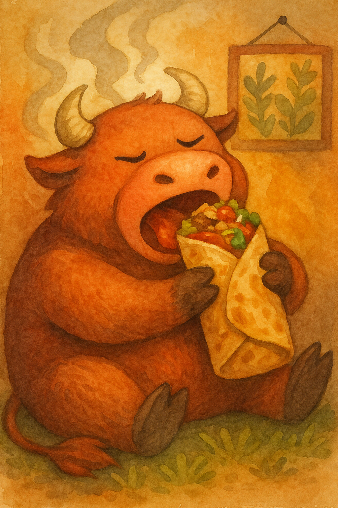

# Migration Guide: Old Format → New Format

This guide helps you manually migrate existing Kumpli recipes from the old single-markdown format to the new folder-based structure.

## Overview

**Old Format:**
```
recipes/
├── boos_smoky_burrito_of_bravery.md    # All content in one file
├── the_ultimate_okonomiyaki.md
└── ...
images/
├── illustrations/
│   ├── boos_smoky_burrito_of_bravery.png
│   └── the_ultimate_okonomiyaki.png
└── photos/
    ├── boos_smoky_burrito_of_bravery-p1.png
    └── ...
```

**New Format:**
```
recipes/
├── boos-smoky-burrito-of-bravery/
│   ├── recipe.json                      # Structured data
│   ├── story.md                         # Narrative content
│   ├── illustration.png                 # Images in same folder
│   └── photo-1.jpg
├── the-ultimate-okonomiyaki/
│   ├── recipe.json
│   ├── story.md
│   └── ...
```

---

## Migration Steps

### Step 1: Choose a Recipe to Migrate

Start with a simple recipe first to get comfortable with the process. Complex recipes with many ingredients/photos can be migrated later.

### Step 2: Create New Recipe Folder

Use the template generator:

```bash
python scripts/recipe_template_generator.py "Recipe Title"
```

Or create manually:
```bash
mkdir recipes/recipe-slug
touch recipes/recipe-slug/recipe.json
touch recipes/recipe-slug/story.md
```

### Step 3: Open Both Files

Open the old markdown file and the new `recipe.json` side by side.

### Step 4: Extract Metadata → recipe.json

Copy metadata from the old markdown "Tags & Metadata" section to `recipe.json`.

**Old format example:**
```markdown
## Tags & Metadata
Cuisine: Mexican-inspired  
Type: Burrito  
Gluten-free: No  
Difficulty: Medium  
Spicy: Buldak  
Serves: 2–3 Kumplis  
Good for: comfort-food, emotional reset, bull-awakening, cooking-together  
Seasonality: anytime  
Ingredient Access: standard-eu  
Ingredient Count: 18  
Storage: Best fresh; burritos can be wrapped in foil and kept in fridge for up to 2 days  
Reheating: Oven (foil wrapped) at 180°C for 10–15 min  
Pairing: Lime soda, spicy pickled onions, or just your hands  
Tags: soul-warming, gerzemice-friendly, boo-approved, meaty, hand-eaten
```

**New JSON format:**
```json
{
  "title": "Boo's Smoky Burrito of Bravery",
  "slug": "boos-smoky-burrito-of-bravery",
  "emoji": "🌯🔥",
  "metadata": {
    "cuisine": "Mexican-inspired",
    "type": "Burrito",
    "gluten_free": false,
    "difficulty": "Medium",
    "spicy": "Buldak",
    "serves": "2-3 Kumplis",
    "good_for": ["comfort-food", "emotional reset", "bull-awakening", "cooking-together"],
    "seasonality": "anytime",
    "ingredient_access": "standard-eu",
    "ingredient_count": 18,
    "storage": "Best fresh; burritos can be wrapped in foil and kept in fridge for up to 2 days",
    "reheating": "Oven (foil wrapped) at 180°C for 10–15 min",
    "pairing": "Lime soda, spicy pickled onions, or just your hands",
    "tags": ["soul-warming", "gerzemice-friendly", "boo-approved", "meaty", "hand-eaten"]
  }
}
```

**Key conversions:**
- `Gluten-free: No` → `"gluten_free": false`
- `Good for: x, y, z` → `"good_for": ["x", "y", "z"]`
- `Tags: x, y, z` → `"tags": ["x", "y", "z"]`
- Use underscore (`_`) instead of spaces in JSON keys

### Step 5: Extract Timing → recipe.json

**Old format:**
```markdown
## Time Needed
- Preparation Time: 30 minutes
- Total Time: 45 minutes
```

**New JSON:**
```json
"timing": {
  "prep_minutes": 30,
  "total_minutes": 45
}
```

### Step 6: Extract Ingredients → recipe.json

**Old format (grouped):**
```markdown
## Ingredients

### 🔥 Steak & Marinade
- 500–600g flank steak
- 2 tbsp tomato paste
- 1 tsp smoked paprika
- ½ tsp chili flakes

### 🌾 Cilantro-Lime Rice
- 200g cooked white rice (about 1 cup)
- 1 tbsp lime juice
```

**New JSON (grouped):**
```json
"ingredients": [
  {
    "group": "🔥 Steak & Marinade",
    "items": [
      {
        "amount": "500-600g",
        "item": "flank steak"
      },
      {
        "amount": "2 tbsp",
        "item": "tomato paste"
      },
      {
        "amount": "1 tsp",
        "item": "smoked paprika"
      },
      {
        "amount": "½ tsp",
        "item": "chili flakes"
      }
    ]
  },
  {
    "group": "🌾 Cilantro-Lime Rice",
    "items": [
      {
        "amount": "200g",
        "item": "cooked white rice",
        "notes": "about 1 cup"
      },
      {
        "amount": "1 tbsp",
        "item": "lime juice"
      }
    ]
  }
]
```

**Tips:**
- Keep group names with emojis (they're part of Kumpli style!)
- Text in parentheses becomes `"notes"` field
- Use `"notes"` for preparation instructions like "minced", "chopped", "fresh or frozen"

### Step 7: Extract Instructions → recipe.json

**Old format:**
```markdown
## Instructions

1. **Marinate the Steak:** Mix the tomato paste, paprika, chili, cumin, garlic, oil, lime juice, salt, and pepper. Rub onto steak and marinate 30 minutes to overnight.
2. **Prepare Rice:** Mix warm cooked rice with lime juice, zest, cilantro, and salt.
3. **Char the Corn:** In a hot dry pan, sear corn until blackened spots appear. Mix with onion, lime, jalapeño, and salt.
```

**New JSON:**
```json
"instructions": [
  {
    "title": "Marinate the Steak",
    "step": "Mix the tomato paste, paprika, chili, cumin, garlic, oil, lime juice, salt, and pepper. Rub onto steak and marinate 30 minutes to overnight."
  },
  {
    "title": "Prepare Rice",
    "step": "Mix warm cooked rice with lime juice, zest, cilantro, and salt."
  },
  {
    "title": "Char the Corn",
    "step": "In a hot dry pan, sear corn until blackened spots appear. Mix with onion, lime, jalapeño, and salt."
  }
]
```

**Tips:**
- Bold text in old format becomes `"title"` field
- If no bold titles exist, just use `"step"` field without title
- Keep step numbering in your head, JSON array order determines sequence

### Step 8: Extract Background Story → story.md

**Old format:**
```markdown
## Background

Sometimes, Boo doesn't need a fork. He needs *power in a package*. This is the meal he holds with both hands — no cutlery, no hesitation, just pure, smoky satisfaction. It steams like the inside of a mossy forest cabin and roars like a small, happy bull inside his chest.

In Kumpli mythology, this burrito is a sacred comfort ritual. When Boo's tail droops and the fire dims behind his eyes, Maa might hand him this bundle of meat, rice, crunch, and heat. No fluff. No ceremony. Just a wrap of soul-filling strength. Ciraf peeks. Miku cheers. The bull inside Boo feasts.

*"You don't nibble this. You bite until your teeth feel proud."*


*Boo, mid-bite, surrounded by steam, spice, and slight smugness.*
```

**New story.md:**
```markdown
# Background

Sometimes, Boo doesn't need a fork. He needs *power in a package*. This is the meal he holds with both hands — no cutlery, no hesitation, just pure, smoky satisfaction. It steams like the inside of a mossy forest cabin and roars like a small, happy bull inside his chest.

In Kumpli mythology, this burrito is a sacred comfort ritual. When Boo's tail droops and the fire dims behind his eyes, Maa might hand him this bundle of meat, rice, crunch, and heat. No fluff. No ceremony. Just a wrap of soul-filling strength. Ciraf peeks. Miku cheers. The bull inside Boo feasts.

*"You don't nibble this. You bite until your teeth feel proud."*


*Boo, mid-bite, surrounded by steam, spice, and slight smugness.*
```

**Key changes:**
- Keep the `## Background` heading
- Keep all narrative text as-is
- Change image path from `../images/illustrations/boos_smoky_burrito_of_bravery.png` to just `illustration.png`
- Images will be moved to recipe folder in next step

### Step 9: Extract Kumpli Notes → story.md

**Old format:**
```markdown
## Kumpli Notes

Eat it like a bull. No shame. Just big bites, steam, and fire. Ciraf likes to sit nearby, watching admiringly — but not too close, because Boo is in burrito mode.
```

**Append to story.md:**
```markdown
## Kumpli Notes

Eat it like a bull. No shame. Just big bites, steam, and fire. Ciraf likes to sit nearby, watching admiringly — but not too close, because Boo is in burrito mode.
```

### Step 10: Extract Cooking Moments → story.md

If the old recipe has a "Cooking Moments" section with photos:

**Old format:**
```markdown
## 📸 Cooking Moments


*The steak soaking in smoky marinade*


*Layering the ingredients*
```

**Append to story.md:**
```markdown
## Cooking Moments


*The steak soaking in smoky marinade*


*Layering the ingredients*
```

### Step 11: Move Images

Move images from old structure to new recipe folder:

```bash
# Move illustration
mv images/illustrations/boos_smoky_burrito_of_bravery.png \
   recipes/boos-smoky-burrito-of-bravery/illustration.png

# Move photos (rename sequentially)
mv images/photos/boos_smoky_burrito_of_bravery-p1.png \
   recipes/boos-smoky-burrito-of-bravery/photo-1.jpg

mv images/photos/boos_smoky_burrito_of_bravery-p2.png \
   recipes/boos-smoky-burrito-of-bravery/photo-2.jpg
```

**Naming convention:**
- Main illustration: `illustration.png` or `illustration-1.png`
- Additional illustrations: `illustration-2.png`, `illustration-3.png`
- Process photos: `photo-1.jpg`, `photo-2.jpg`, `photo-3.jpg`
- Use descriptive names if helpful: `photo-marinating.jpg`, `illustration-final-plating.png`

### Step 12: Validate

Run validation to check your work:

```bash
python scripts/validate_recipes.py recipes/boos-smoky-burrito-of-bravery
```

Fix any warnings (but remember: creativity > rules!)

### Step 13: Delete Old Files

Once validated and you're happy with the new structure:

```bash
# Delete old markdown
rm recipes/boos_smoky_burrito_of_bravery.md

# Delete old images (already moved)
rm images/illustrations/boos_smoky_burrito_of_bravery.png
rm images/photos/boos_smoky_burrito_of_bravery-p*.png
```

---

## Quick Reference Cheatsheet

| Old Format | New JSON Field | Notes |
|------------|---------------|-------|
| `## Background` | → `story.md` | Copy as-is |
| `## Kumpli Notes` | → `story.md` | Copy as-is |
| `## Portions` | Skip | Merged into `metadata.serves` |
| `Cuisine: X` | `metadata.cuisine` | String |
| `Gluten-free: Yes` | `metadata.gluten_free` | Boolean (true/false) |
| `Good for: x, y` | `metadata.good_for` | Array of strings |
| `Tags: x, y, z` | `metadata.tags` | Array of strings |
| `Preparation Time: X min` | `timing.prep_minutes` | Integer |
| `- 500g ingredient` | `ingredients[].item` | Split amount/item/notes |
| `1. **Step:** Text` | `instructions[].title` + `.step` | Separate title from text |
| `` | `` | Simple filename only |

---

## Common Pitfalls

### ❌ Wrong: Absolute paths in story.md
```markdown


```

### ✅ Right: Filename only
```markdown

```

---

### ❌ Wrong: Comma-separated tags in JSON
```json
"tags": "soul-warming, boo-approved, meaty"
```

### ✅ Right: Array of strings
```json
"tags": ["soul-warming", "boo-approved", "meaty"]
```

---

### ❌ Wrong: Mixing amount and item
```json
{
  "item": "500g flank steak"
}
```

### ✅ Right: Separate fields
```json
{
  "amount": "500g",
  "item": "flank steak"
}
```

---

## Migration Tracker

Track your progress as you migrate recipes:

- [ ] boos_smoky_burrito_of_bravery.md
- [ ] the_ultimate_okonomiyaki.md
- [ ] choo-night-bibimbap-bowl.md
- [ ] cozy_rum_hot_chocolate.md
- [ ] emergency_feast_of_eternal_laziness.md
- [ ] peri-peri-livers-de-la-kukli.md
- [ ] savoy_snuggle_stack.md
- [ ] seoul_smasher.md
- [ ] batata_and_coconut_soup.md
- [ ] tor-boo-s_kulmsupp.md

---

## Tips for Success

1. **Start simple**: Migrate easiest recipes first to build confidence
2. **Work in batches**: Migrate 2-3 recipes, take a break, continue
3. **Use ChatGPT**: For complex recipes, paste the old markdown and ask ChatGPT to generate the JSON (use `gpt-instructions/01-recipe-json.md`)
4. **Validate often**: Run validation after each recipe to catch errors early
5. **Keep git history**: Don't worry about deleting old files—git remembers everything!
6. **Preserve creativity**: If something doesn't fit the schema, keep it anyway (validation is non-blocking)

---

## Getting Help

If you get stuck:
1. Check `docs/recipe-format-reference.md` for detailed field descriptions
2. Look at `recipe.schema.json` for the authoritative structure
3. Run `python scripts/recipe_template_generator.py "Test Recipe"` to see a complete example
4. Remember: This is a hobby project—perfection is optional, creativity is mandatory! 🥔✨

---

## Advanced: Grouped Instructions

For complex recipes with multiple phases, use grouped instructions instead of flat lists.

### When to Use Grouped Instructions

Use grouped instructions when:
- Recipe has distinct phases (prep → cook → assemble)
- Multiple components are prepared separately
- Recipe includes variants or alternative methods

### Migration Example: Bibimbap Bowl

**Old Markdown Format:**
```markdown
## Instructions

1. **Make the Sauce**: In a small bowl, mix gochujang, sesame oil, sugar...

2. **Prep the Vegetables**:
   * **Spinach**: Blanch briefly, drain, and season...
   * **Bean Sprouts**: Blanch 2 minutes, then toss...
   * **Carrot, Zucchini, Mushrooms**: Sauté each separately...

3. **Cook the Eggs**: Fry sunny side up until whites are set...

4. **Assemble the Bowl**:
   * Scoop warm rice into each wide bowl.
   * Artfully arrange each topping...
```

**New JSON Format (Grouped):**
```json
"instructions": [
  {
    "group": "Prepare the Sauce",
    "steps": [
      {
        "step": "In a small bowl, mix gochujang, sesame oil, sugar, water, vinegar, soy sauce, and garlic."
      },
      {
        "step": "Add toasted sesame seeds if using. Stir until smooth and glossy."
      }
    ]
  },
  {
    "group": "Prep the Vegetables",
    "steps": [
      {
        "title": "Spinach",
        "step": "Blanch briefly, drain, and season with a pinch of salt and sesame oil."
      },
      {
        "title": "Bean Sprouts",
        "step": "Blanch 2 minutes, then toss with salt and sesame oil."
      },
      {
        "title": "Carrot, Zucchini, Mushrooms",
        "step": "Sauté each separately in a touch of oil with salt. Keep them crisp-tender."
      }
    ]
  },
  {
    "group": "Cook the Eggs",
    "steps": [
      {
        "step": "Fry sunny side up until whites are set and yolks are runny."
      }
    ]
  },
  {
    "group": "Assembly",
    "steps": [
      {
        "step": "Scoop warm rice into each wide bowl."
      },
      {
        "step": "Artfully arrange each topping in its own section around the bowl."
      },
      {
        "step": "Place the egg in the center."
      },
      {
        "step": "Drizzle generously with gochujang sauce and sprinkle with sesame seeds and seaweed."
      }
    ]
  }
]
```

---

## Advanced: Multi-Recipe Folders (Variants)

Some recipes have substantial variants that deserve separate recipe files.

### When to Split into Multiple Recipe Files

Create separate `recipe.{variant}.json` files when:
- Ingredients differ significantly (>30% change)
- Cooking method is substantially different
- Each version deserves its own title and identity

**Example: Seoul Smasher (Korean vs. Classic)**

**Folder structure:**
```
recipes/seoul-smasher/
├── recipe.json           # Korean fusion version
├── recipe.classic.json   # Classic OG burger
├── story.md              # Shared narrative for both
└── photos/
    ├── korean-version.jpg
    └── classic-version.jpg
```

**recipe.json** (Korean version):
```json
{
  "title": "Seoul Smasher (Korean Fusion)",
  "slug": "seoul-smasher",
  "emoji": "🍔🌶️",
  "ingredients": [
    {
      "group": "Gochujang Aioli",
      "items": [
        {"amount": "3 tbsp", "item": "mayo"},
        {"amount": "1 tbsp", "item": "gochujang"}
      ]
    }
  ],
  "instructions": [...]
}
```

**recipe.classic.json** (OG version):
```json
{
  "title": "Seoul Smasher Classic (OG Burger)",
  "slug": "seoul-smasher-classic",
  "emoji": "🍔🌽",
  "ingredients": [
    {
      "group": "Burger Sauce",
      "items": [
        {"amount": "3 tbsp", "item": "mayo"},
        {"amount": "1 tbsp", "item": "ketchup"},
        {"amount": "1 tsp", "item": "mustard"}
      ]
    }
  ],
  "instructions": [...]
}
```

**story.md** (shared):
```markdown
## Background
We've always loved burgers... [tells story of both versions]

## Kumpli Notes
Both versions are delicious...
```

### Alternative: Small Variants in Instructions

For **minor variations** (simple substitutions), don't create separate files. Instead:

**Option 1: Add as final instruction group**
```json
{
  "group": "Variations",
  "steps": [
    {
      "title": "For spicy version",
      "step": "Add 1 tsp chili flakes to the sauce."
    },
    {
      "title": "Vegetarian option",
      "step": "Replace beef with grilled portobello mushrooms."
    }
  ]
}
```

**Option 2: Add as notes in steps**
```json
{
  "title": "Add cheese",
  "step": "Sprinkle cheddar cheese on top. For extra spicy: mix in jalapeños."
}
```

---


---

## Advanced: Substeps (Variants within Steps)

For recipes with optional variations or alternatives within a single step, use the `substeps` field.

### When to Use Substeps

Use substeps when:
- A step has optional additions (spice levels, garnishes)
- Multiple serving suggestions for the same step
- Simple substitutions or alternatives
- Variant flavors within the same recipe

### Migration Example: Hot Chocolate with Variants

**Old Markdown Format:**
```markdown
## Instructions

4. **Finish the hot chocolate**: Remove from heat and stir in vanilla. For Elf mug(s): add 1–2 tbsp rum per serving. For Small Kumpli mugs: add a tiny pinch of chili for a warm playful kick.
```

**New JSON Format (with substeps):**
```json
{
  "title": "Finish the hot chocolate",
  "step": "Remove from heat and stir in vanilla.",
  "substeps": [
    {
      "title": "For Elf version",
      "step": "Add 1–2 tbsp rum per serving."
    },
    {
      "title": "For Small Kumpli version",
      "step": "Add a tiny pinch of chili for a warm playful kick."
    }
  ]
}
```

### Substeps vs. Groups vs. Separate Files

**Use substeps when:**
- Variants are optional additions to the same base
- Differences are minor (seasoning, garnish, optional ingredients)
- All variants share the same core recipe

**Use groups when:**
- Recipe has distinct phases (prep, cook, assembly)
- Multiple components prepared separately
- Clear workflow stages

**Use separate recipe files when:**
- Ingredients differ significantly (>30%)
- Cooking method is substantially different
- Each version deserves its own title and identity

---

