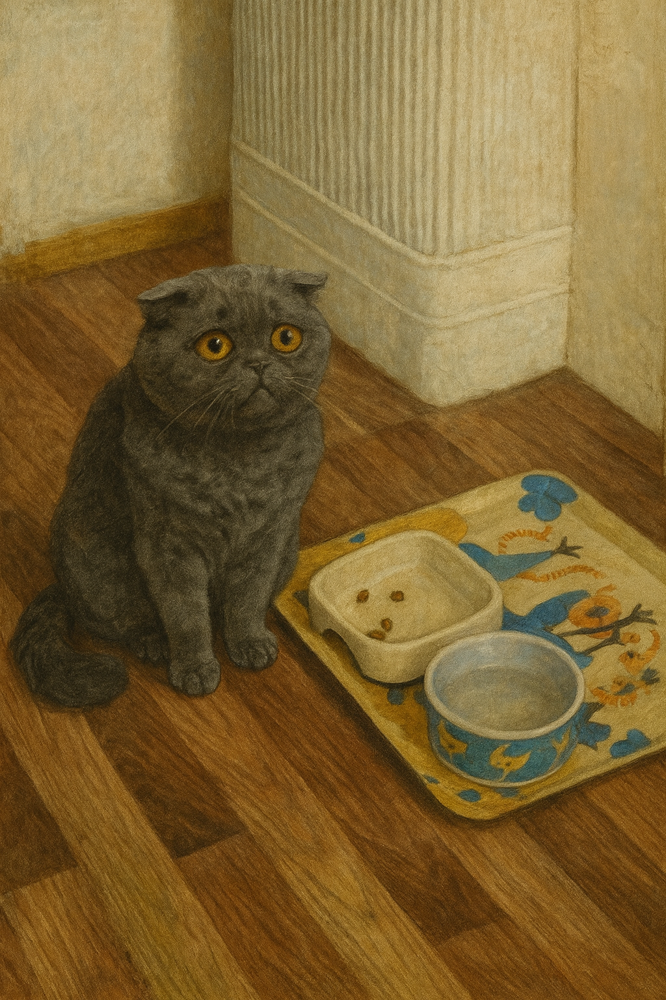

## Background

This is Maa's soup.

She discovered it during a gentle summer in Medvelak — the bear-quiet cottage nestled in the woods, where trees listened and time slowed down. It became a ritual of sweetness and stillness. The first time she made it, the batata melted like sunlight in her hands, and the coconut milk steamed like breath on a cool morning.

Maa doesn't always like soup. But this one? It's different. It tastes like dessert and memory at once — soft, sweet, lightly spiced. Like something kind from a dream that stayed behind in the pot. She often cooked it barefoot, the floor still cool from night, with Ciraf perched quietly nearby, watching every move as if the soup were a spell.

There's something about batata that speaks directly to the Kumpli soul — earthy, golden, and a little bit magical. No one ever said it out loud, but everyone knew: some roots are family.

In those moments, nothing else was needed. Just Maa, Ciraf, and the comforting scent of batata and cardamom curling through the cottage like a hug.

  
*Ciraf, watching Maa with devoted curiosity while the batatas melt into coconut dreams.*

## Kumpli Notes

Best enjoyed barefoot, with Ciraf on the table and no plans for the next few hours. This soup has soul-soothing sweetness written into its spices, just like Maa likes it.

⚠️ Important Kumpli Reminder: don't forget Pupi's bowl. She's watching. Silently. Judging. And no — she still won't eat this soup, even if you call it "Batata Royale avec mousse de coco."

## Cooking Moments

### Ciraf's Soup Supervision

  
*Ciraf stands guard beside the golden batata soup, dressed in her fanciest tulle — awaiting the first taste like a true kitchen mascot.*

### Boo, Maa, and Ciraf: Kumpli Suppertime

  
*A cozy moment: Kumpli couple and Ciraf enjoying their favorite comfort soup, no shoes, no worries, just warm spoons and full hearts.*

### Pupi's Protest (Where's My Bowl?)

  
*Pupi has noticed the soup party. Her bowl is empty. Her expression says everything.*
