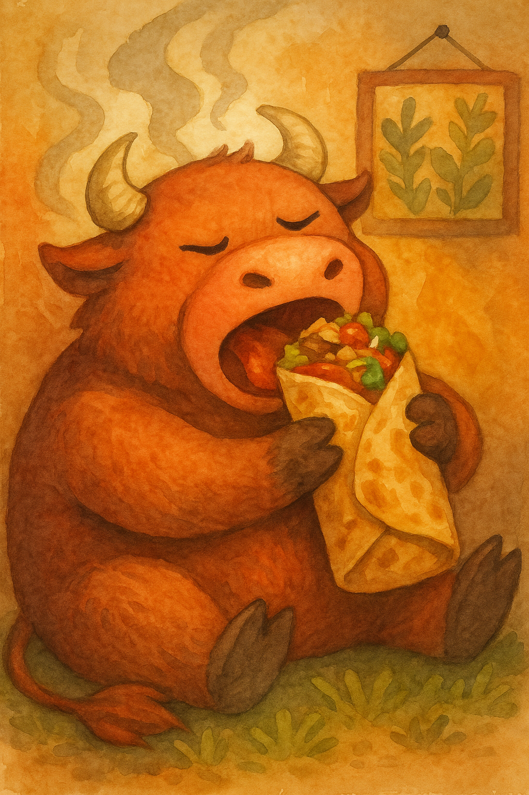

# Kumpli Recipe: Boo’s Smoky Burrito of Bravery 🌯🔥

## Background

Sometimes, Boo doesn’t need a fork. He needs *power in a package*. This is the meal he holds with both hands — no cutlery, no hesitation, just pure, smoky satisfaction. It’s hot, juicy, comforting, and bold. It steams like the inside of a mossy forest cabin and roars like a small, happy bull inside his chest.

In Kumpli mythology, this burrito is a sacred comfort ritual. When Boo’s tail droops and the fire dims behind his eyes, Maa might hand him this bundle of meat, rice, crunch, and heat. No fluff. No ceremony. Just a wrap of soul-filling strength. Ciraf peeks. Miku cheers. The bull inside Boo feasts.

*“You don’t nibble this. You bite until your teeth feel proud.”*

*Boo, mid-bite, surrounded by steam, spice, and slight smugness.*

## Portions
Serves: 2–3 Kumplis

## Time Needed
- Preparation Time: 30 minutes
- Total Time: 45 minutes

## Tags & Metadata
Cuisine: Mexican-inspired  
Type: Burrito  
Gluten-free: No  
Difficulty: Medium  
Spicy: Buldak  
Serves: 2–3 Kumplis  
Good for: comfort-food, emotional reset, bull-awakening, cooking-together  
Seasonality: anytime  
Ingredient Access: standard-eu  
Ingredient Count: 18  
Storage: Best fresh; burritos can be wrapped in foil and kept in fridge for up to 2 days  
Reheating: Oven (foil wrapped) at 180°C for 10–15 min  
Pairing: Lime soda, spicy pickled onions, or just your hands  
Tags: soul-warming, gerzemice-friendly, boo-approved, meaty, hand-eaten

## Ingredients

### 🔥 Steak & Marinade
- 500–600g flank steak
- 2 tbsp tomato paste
- 1 tsp smoked paprika
- ½ tsp chili flakes
- ½ tsp cumin
- 1 tbsp olive oil
- 1 tbsp lime juice
- 3 garlic cloves, minced
- Salt & pepper

### 🌾 Cilantro-Lime Rice
- 200g cooked white rice (about 1 cup)
- 1 tbsp lime juice
- 1 tsp lime zest
- 2 tbsp chopped cilantro
- Salt to taste

### 🌽 Charred Corn Salsa
- 1 cup corn kernels (fresh or frozen)
- ½ small red onion, finely chopped
- 1 small jalapeño (optional), minced
- 1 tbsp lime juice
- Salt & chopped cilantro

### 🫘 Smoky Black Beans
- 1 cup black beans (cooked or canned)
- 1 garlic clove, minced
- 1 tsp cumin
- 1 tsp smoked paprika
- Pinch chili flakes
- Salt

### 🧀 Other Fillings
- 100g shredded cheddar or Jack cheese (~1 cup)
- 2–3 large flour tortillas
- 1 ripe avocado, sliced and sprinkled with lime juice + salt

### 🌶️ Chipotle Crema
- ¼ cup (~60g) sour cream
- 1 tbsp of the same tomato-smoke adobo mix (above)
- 1 tsp lime juice
- Pinch of salt

## Instructions

1. **Marinate the Steak:** Mix the tomato paste, paprika, chili, cumin, garlic, oil, lime juice, salt, and pepper. Rub onto steak and marinate 30 minutes to overnight.
2. **Prepare Rice:** Mix warm cooked rice with lime juice, zest, cilantro, and salt.
3. **Char the Corn:** In a hot dry pan, sear corn until blackened spots appear. Mix with onion, lime, jalapeño, and salt.
4. **Cook the Beans:** Sauté garlic in a little oil, then add beans and spices. Heat gently until fragrant.
5. **Sear the Steak:** Heat a heavy pan with oil until hot. Pat steak dry slightly. Sear 1.5–2 minutes per side. Let rest 5 minutes, then slice thinly against the grain.
6. **Make Crema:** Blend sour cream with chipotle-adobo mix, lime, and salt.
7. **Warm the Tortillas:** Quickly heat in a dry pan or microwave wrapped in a damp towel.
8. **Assemble:** On each tortilla: cheese, rice, beans, steak slices, corn salsa, avocado, and chipotle crema.
9. **Wrap It:** Fold the bottom up, tuck in the sides, and roll tight like Boo’s inner strength.
10. **Optional Toasting:** Pan-sear the finished burrito for extra crisp joy.

## Kumpli Notes

Eat it like a bull. No shame. Just big bites, steam, and fire. Ciraf likes to sit nearby, watching admiringly — but not too close, because Boo is in burrito mode.

## 📸 Cooking Moments
