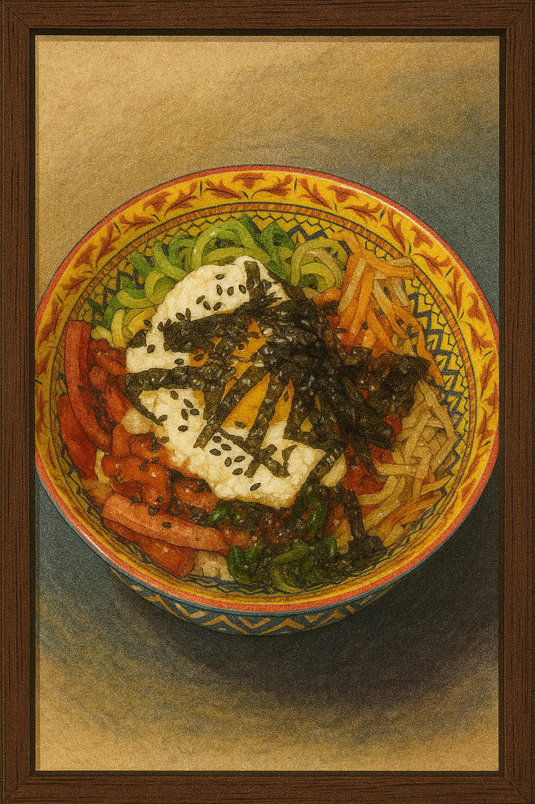

## Background

This dish is a warm, red-sauced hug for Boo and Maa on quiet evenings when the world narrows to three things: a bowl of rice, a streaming Korean rom-com, and the soft presence of their Schottish fold cat, Pupi, asleep at their feet. They call these shows "Choo series," named after the dramatic "choo!" shouts echoing from palace halls every time a prince or highness is summoned.

The sauce comes together without cooking — it's bold and silky, just like the drama. The bowl? It's a gentle layering of textures and color. And when the second lead cries in the rain and someone faints dramatically from heartbreak, it only makes the flavors better.

## Kumpli Notes

Best enjoyed on the couch with a Choo series, fuzzy socks, and Pupi the cat asleep nearby. Ciraf says it's even better with a tiny dish of apple slices for dessert. 🐘🍎

## Cooking Moments

### Maa's Cozy Bibimbap and Miso

*Maa prepared the original version. The soft setup with forest placemat and sesame-dusted toppings is exactly how she loves it.*

### Boo's Gerzemice Bowl?

*Bibimbap à la Boo — with sausage and invention. A framed tribute to playful remixing.*
