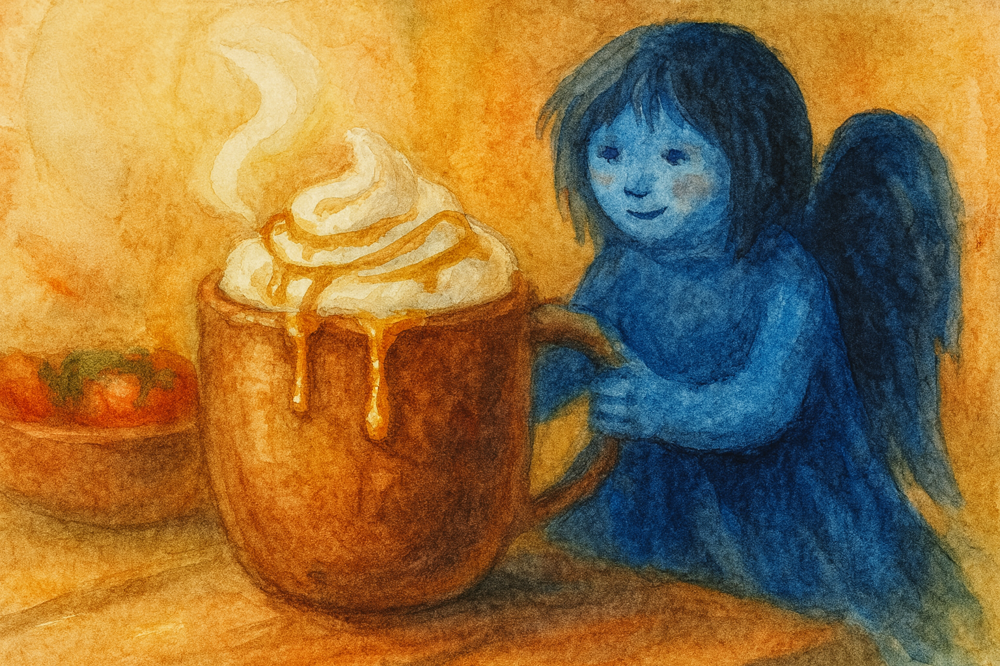
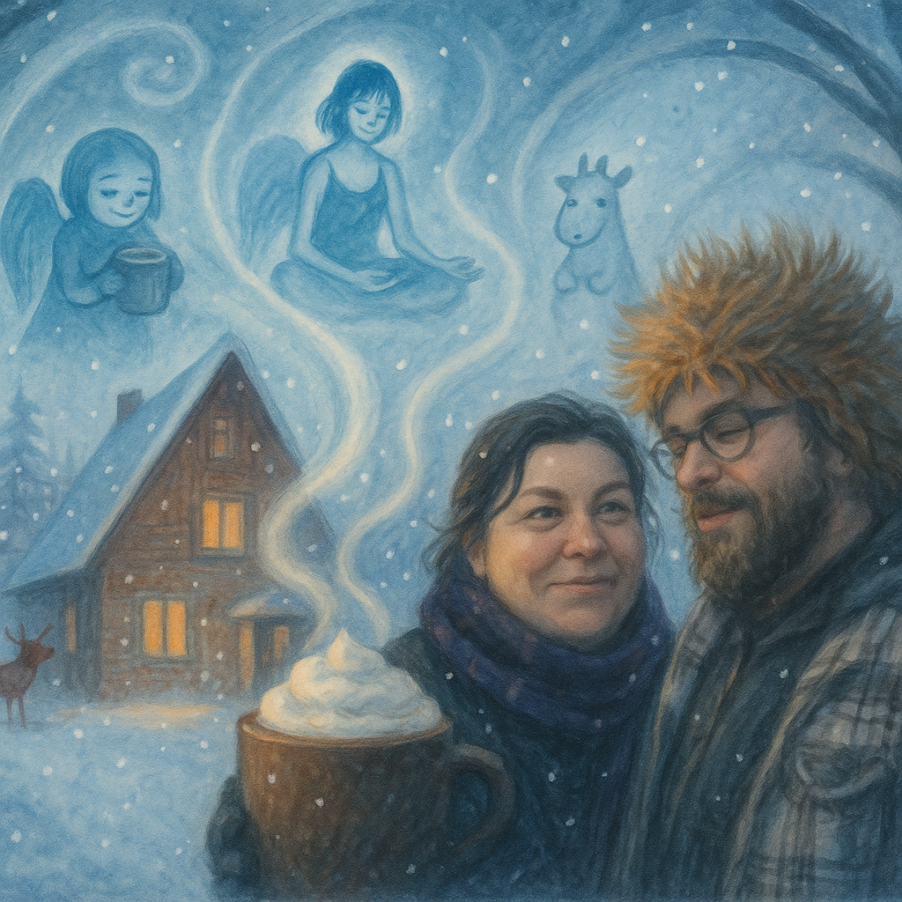

# Kumpli Recipe: Cozy Rum Hot Chocolate for Four — Salted Caramel Edition

## Background

Each winter, when the Northern Forest turns into a vast cathedral of shimmering white, the Elf leaves the warm cabin behind and travels north with her faithful reindeer. They camp beneath tall pines, where the world becomes soft and endless. The Elf meditates there for days, melting little pockets of snow with gentle magic or planting tomatoes she brought from home — tiny sparks of life in a land that sleeps. Sometimes she sits for hours watching her reindeer toss pine cones into the air, playful as drifting snowflakes.

When she finally returns to the southern cabin, carrying the stillness of the northern winds, **Gombocom** is already waiting. She stands on a stool, stirring a steaming pot almost too big for her tiny blue hands. Two versions are always prepared:
– **a rum-warmed mug for the Elf**,
– and a **chili-spiced hot chocolate** for Gombocom, Ciraf, and Silt, who are far too small (and far too mischievous) for alcohol but adore a playful winter burn.

The moment the Elf steps inside, snow still clinging to her cloak, the entire kitchen seems to exhale — a soft return, a warm welcome, and a reminder that winter’s quietude always leads back to shared cups and glowing cheeks.

*Upon a towering mug of hot chocolate, where whipped cream rises like a snowy northern peak, the Moon Elf meditates in silence while her reindeer plays with a pine cone beside her.*

## Portions

Serves: **4 Kumplis**

## Time Needed

* Preparation Time: **10 minutes**
* Total Time: **15 minutes**

## Tags & Metadata

Cuisine: Winter Cozy
Type: Hot Drink
Gluten-free: Yes
Difficulty: Easy
Spicy: None (rum version), Mild Spice (chili version)
Serves: 4
Good for: Cold evenings, after-meditation rituals, snowy returns
Seasonality: Winter
Ingredient Access: standard-eu
Ingredient Count: 12
Storage: Best consumed fresh
Reheating: Warm gently on low heat; do not boil
Pairing: Cinnamon rolls, ginger biscuits, quiet evenings
Tags: hot chocolate, winter drink, rum, chili chocolate, salted caramel, kumpli universe, elf drink

---

## Ingredients

### **Hot Chocolate Base**

* 1 liter whole milk
* 250 ml heavy cream
* 4 tbsp cocoa powder
* 80 g dark chocolate, chopped
* 3–4 tbsp sugar or honey (to taste)
* ½ tsp ground cinnamon
* ¼ tsp ground nutmeg
* 2 tsp vanilla extract
* 4–8 tbsp dark rum (for Elf only)
* Small pinch of chili flakes or chili powder (for Gombocom, Ciraf, Silt version)

### **Whipped Cream Topping**

* 150–200 ml heavy cream
* 1–2 tsp sugar (optional)
* ½ tsp vanilla extract (optional)

### **Salted Caramel Drizzle**

* 2 tbsp sugar
* 1 tbsp water
* 1 tbsp butter
* 30–40 ml heavy cream
* Pinch of salt or flaky salt

---

## Instructions

1. **Heat the base:**
   Warm the milk and cream in a medium pot over medium heat until steaming — do not let it boil.

2. **Add dry ingredients:**
   Whisk in cocoa powder, sugar/honey, cinnamon, and nutmeg.

3. **Melt the chocolate:**
   Add chopped dark chocolate and whisk until smooth, glossy, and fully melted.

4. **Finish the hot chocolate:**
   Remove from heat and stir in vanilla.

   * **Elf mug(s):** add 1–2 tbsp rum per serving.
   * **Small Kumpli mugs:** add a tiny pinch of chili for a warm playful kick.

5. **Whipped cream:**
   Beat the cream to soft peaks; add sugar or vanilla if desired.

6. **Salted caramel:**

   * Heat sugar + water until deep golden (do not stir).
   * Remove from heat and whisk in butter.
   * Add cream and salt; whisk until silky.

7. **Assemble the mugs:**
   Pour the hot chocolate into cups, add whipped cream, drizzle with caramel, and sprinkle a hint of salt for sparkle.

---

## Kumpli Notes

When Maa and Boo drink this hot chocolate in their own winter, a gentle echo appears inside them. They feel the Elf warming her hands after days in the snow, Gombocom humming proudly beside the pot, Ciraf wiggling her ears at the chili spark, and Silt quietly enjoying her cup.

Even in the coldest months, this drink reminds all Kumplis — outer and inner — that warmth is something we share, and something that always finds its way home.

---

# 📸 Cooking Moments

### 📸 Gomboc’s Offering

*Gomboc offers a mug far bigger than herself — a warm welcome-home gift for the Elf returning from the northern snows.*

### 📸 Cooking Moment — Winter Outside, Warmth Inside

*In the quiet snowfall outside their cottage, Maa and Boo share a warm moment — and the rising steam from a giant mug reveals gentle dream-shapes of their inner figures: the meditating Elf, Gomboc with her tiny cup, and the soft reindeer watching over them.*
