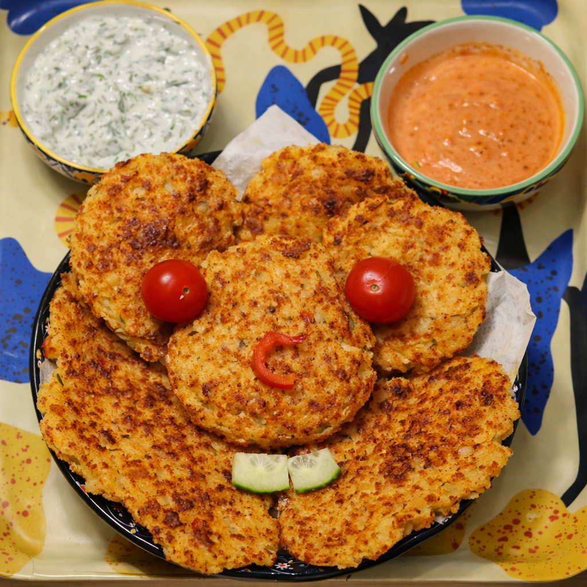
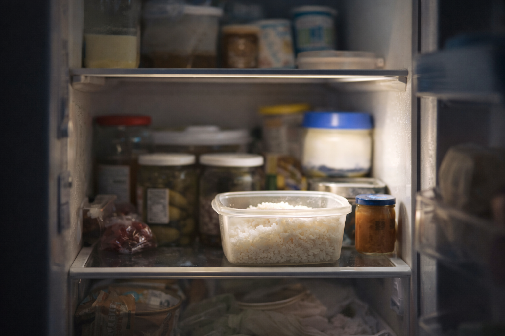
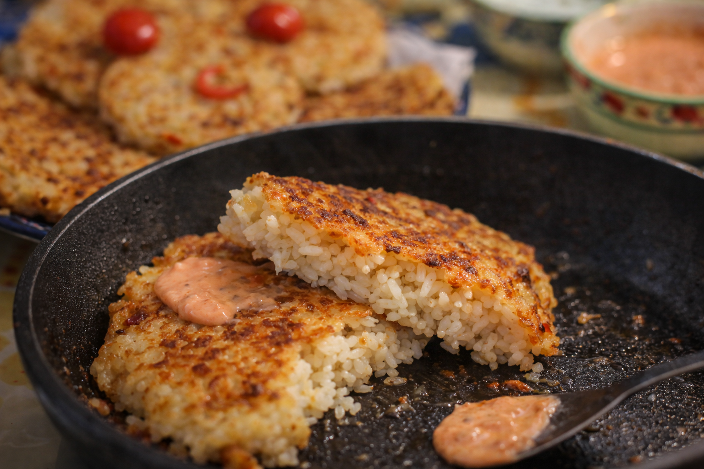
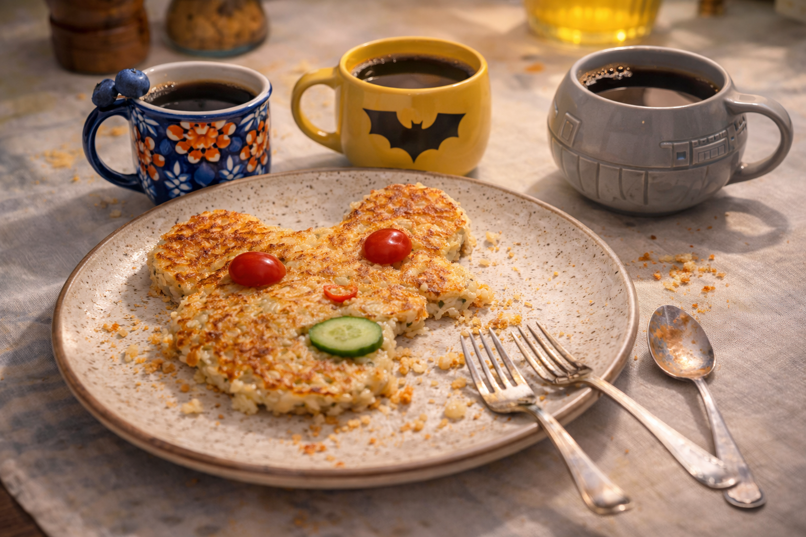

## Background

Morning in the Kumpli kitchen starts very normally. The light is a bit sleepy, the kettle sighs, and the usual breakfast suspects are already on the counter: bread, butter, something that has seen too many Mondays. It’s exactly the kind of morning that could slide by on autopilot, without anyone doing anything even slightly adventurous.

Then the fridge door opens.

Inside, a whole little town of leftovers tries to look busy. The yogurt concentrates on its expiry date. The pickles pretend they are immortal. And in one corner, in a small plastic box, sits yesterday’s rice: a quiet white crowd, edges a bit dry, politely waiting to see if today is the day… or if they’ll slowly become fridge ghosts. The rice-kami are gentle, but they whisper a very soft, very hopeful “Maybe…?”

That’s when Gomboc notices them. She’s already awake on the counter, legs swinging, ears tuned to tiny moods — and today, she might even answer to Princesa Mangostino, depending on how important the situation feels. She calls for backup: Batman Gomboc and Vader Gomboc arrive at once, eyes shining with the most noble of intentions — which is, of course, to eat as much cheese as possible without upsetting anyone important, especially not the rice-kami.

They hold a quick council. Wasting rice would definitely make the rice-kami grumpy. But turning the rice into something crispy and covering it in cheese? That feels like a completely respectful solution. So into a bowl goes the leftover rice, with a relieved little rustle, then an egg, a bit of flour… and then the Gombocs’ true objective: generous handfuls of shredded cheese, “for balance,” “for structure,” and mostly “because cheese.”

Soon small, determined rice patties are forming, and the pan begins to sing. The rice-kami are satisfied: every grain gets a new life, golden and crackly at the edges. The Gomboc-crowd is satisfied: there is melted cheese everywhere. And by the time the plate is empty, the boring morning has quietly turned into a tiny Kumpli ceremony of respect — a promise that as long as someone is willing to fry things with enough cheese, no rice has to be forgotten.

*Golden, crackly-edged rice pancakes gather on the plate like a small Gomboc mouse, with tomato eyes, a cucumber smile, and two loyal sauces standing guard — proof that leftovers, when treated kindly (and cheesily), can still play.*

## Kumpli Notes

These pancakes are a true leftover paradise: almost any cooked rice works, and they happily welcome small amounts of cooked meat, vegetables, herbs, or leftover spices mixed straight into the batter. The texture stays best with day-old rice, and the flavor is only limited by what the fridge is willing to give. Dipping sauces are part of the fun — yogurt-based, spicy, creamy, or experimental — choose one for your mood, or two if the Gombocs are involved. Be warned: they are so good that you may end up cooking fresh rice just to make them again for dinner… which, conveniently, creates tomorrow’s leftovers too.

**Variations to try:**
- Add a pinch of smoked paprika for depth
- Mix in cooked ground meat or crumbled bacon for protein
- Serve with a squeeze of lemon and fresh herbs for brightness
- Top with a fried egg for a breakfast sandwich

## Cooking Moments

*Nothing moves yet — but the rice has already noticed the door opening.*

| 日本語 | Romanisation | English |
|---|---|---|
| 音もなく 白き粒あり 朝の底 | Oto mo naku shiroki tsubu ari asa no soko | Without a sound, white grains are there at the bottom of morning. |

*Coffee is poured. Forks are set down. The rice has finished its journey.*
