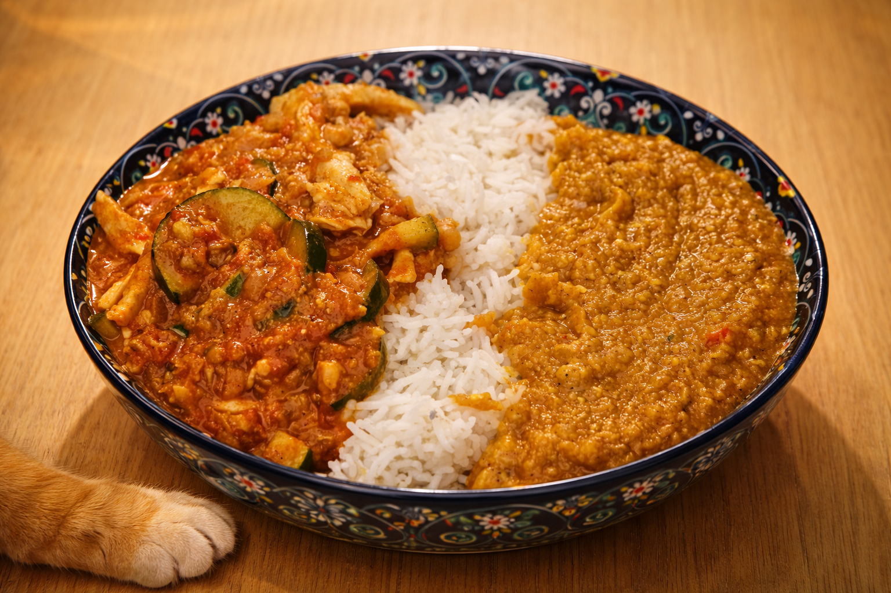
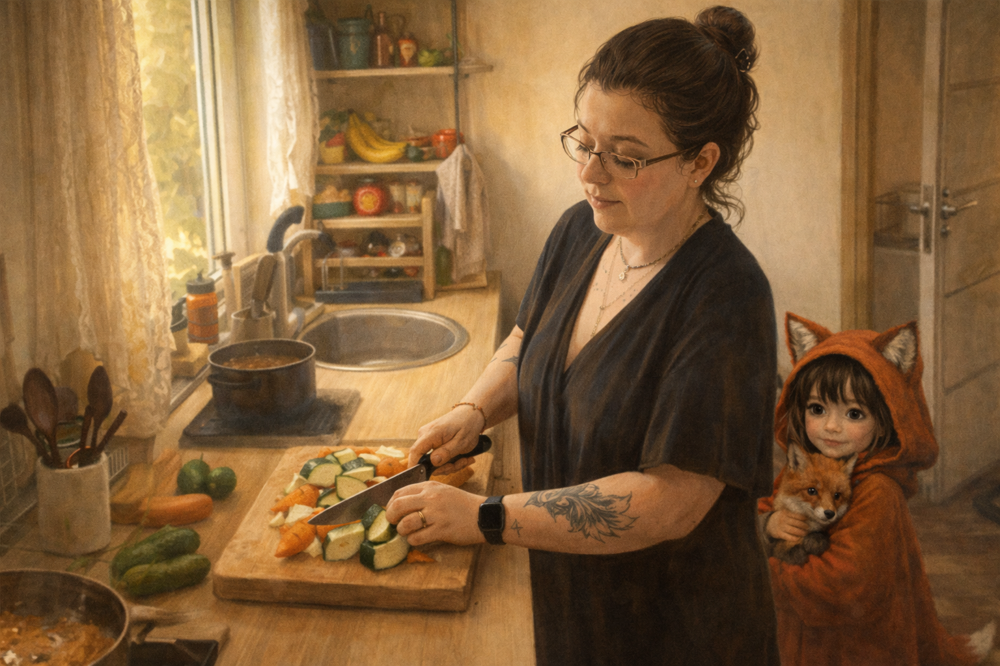
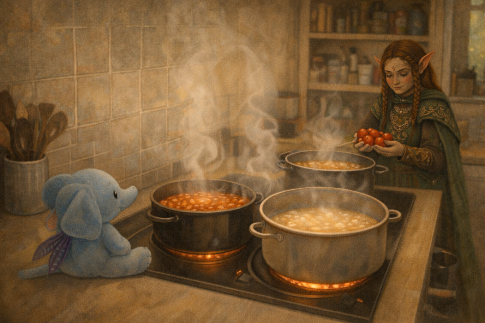
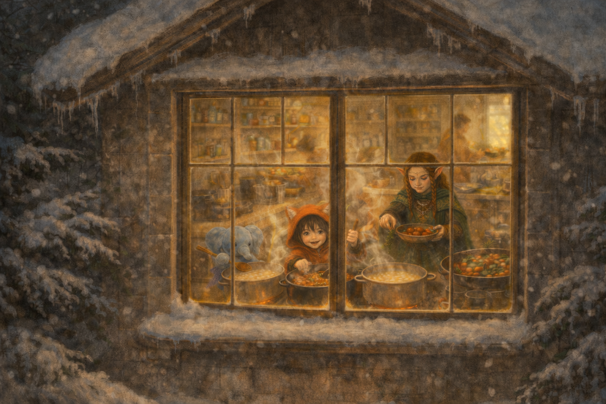

## Background

The kitchen is loud before anyone notices it is.

Not loud like conflict — loud like life: the knock of a knife against wood, the low hiss of oil warming, the soft thump of vegetables landing in bowls. Steam already curls up toward the ceiling, carrying smells that don’t ask permission before mixing.

Maa is chopping.
Big pieces. Always big.

Potatoes cut into chunks that keep their edges. Carrots thick enough to bite back. Zucchini sliced without apology. She never learned to enjoy fine, careful chopping, and tonight she doesn’t try. The board fills fast, uneven and honest.

Around her, the others drift in.

Elf reaches the tomatoes almost without looking. She opens the can, tastes the sauce, adjusts salt with quiet confidence. Tomato is familiar territory — warm, structured, forgiving if you listen. She stirs slowly, watching how the color deepens, how spices bloom when they’re given time. Her pot moves at a steady pace, neither rushing nor waiting.

On another burner, heat rises quicker.

Gomboc is already tasting, already deciding. Chili wakes the air. Not too much — enough to be felt. She adds spice the way someone opens a window: deliberately, to let something real move through the room. Her pot bubbles with intention, demanding attention but not chaos. She smiles when the heat lands exactly where she wants it.

Ciraf is quieter, but she notices everything.

She lifts a spoon from the coconut curry and pauses, waiting for the sweetness to arrive on its own. Onions soften. Vegetables relax. The sauce rounds itself without force. She hums, barely audible, as if encouraging the pot to trust the process. When she finally stirs, it’s gentle, but sure.

Three pots.
Three tempos.

None of them synced.
All of them right.

Silt arrives last, as she often does. She doesn’t take a knife. She doesn’t reach for a pot. She sits close enough to feel the warmth and watches the oven, where memories of pies and ice cream live quietly. No one asks her to help. No one asks her to leave. She stays.

The food is ready before anyone says a word. Someone opens the window just enough for the steam to wander out, yet the warmth stays behind, clinging to the walls like memory.
No one eats the same thing first. Someone steals a bite from the wrong pot and grins without regret.
Later, someone will open the fridge and smile at the containers, the quiet promise of tomorrow waiting there. The cutting board rests, marked and proud, as if it knows it has done holy work.
Nothing is finished, and nothing needs to be. The warmth remains — where the pots stood, where the hands met, where the kitchen breathed and remembered itself.

*Not indecision. Just Faszfej Cica realizing that “all of them” is, in fact, a valid choice — and one he is fully entitled to.*

## Kumpli Notes

Someone will open the fridge later and grin at the leftovers. The cutting board will get another job tomorrow. This kitchen doesn’t mind. It likes being a Kumpli kitchen — full, a little messy, and alive with company.

## Cooking Moments

### Big Pieces, Quiet Beginnings

*This is how it starts: a cutting board, uneven pieces, and a small watcher who no longer needs to hide.*

### Finding Their Voices

*Ciraf watches from a safe place while the curries find their voices. Nearby, the Elf chooses tomatoes carefully — not by rule, but by feel.*

### The Kitchen Speaks

*Light spills into the snow. Steam fogs the window. Inside, nothing is orderly and nothing needs to be.*

*The kitchen hums with work, voices, and waiting food — and if kitchens could choose, this one would say it plainly:*

*I like being a Kumpli kitchen here.* ❤️