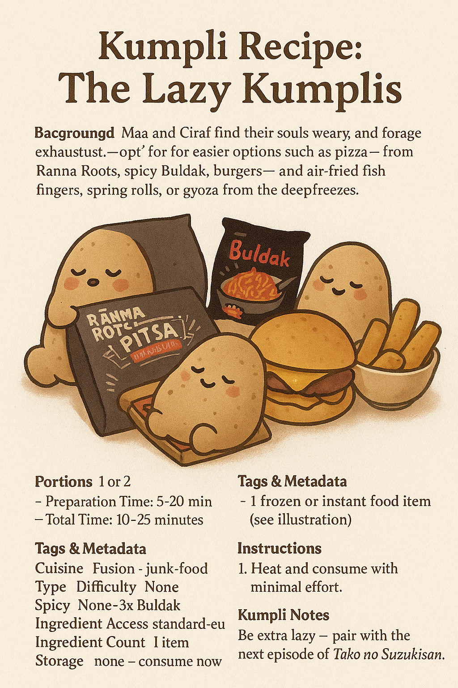

## Background

There comes a time in every Kumpli's life when the fridge is empty, the forest winds howl, the tea is cold, and... effort is extinct. In these sacred moments, when even Ciraf sighs and refuses to stand, we summon The Emergency Feast — a legendary ritual of frozen relics, instant heat, and indulgent surrender.

This is not cuisine. This is **survival art**. It is Maa's firebird sadness soothed by 2x Buldak. Boo's foggy soul anchored by fish fingers and air-fried fries. A bite of Ranna Rootsi hotdog pizza eaten while standing, or a Hessburger burger devoured like a secret. In these feasts, there is no shame. Only fullness.

And when bravery (or sorrow) peaks, Maa once summoned the 3x Buldak. The forest shook. The ravens watched. Boo still speaks of that day with reverence and terror.

*No knife, no pan, no soul left. Just heat and chew.*

## Kumpli Notes

Best eaten in mismatched socks while wrapped in a blanket. Ideal beverage: anything carbonated. Ciraf may require a nibble of pizza crust.
