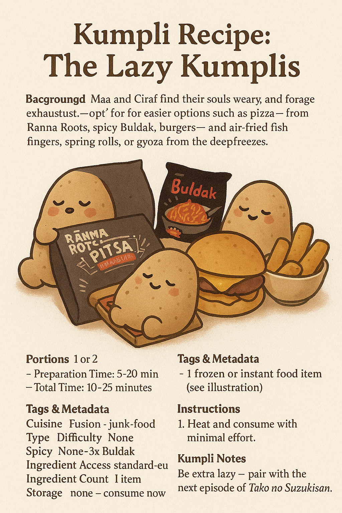

# Kumpli Recipe: Maa & Boo's Emergency Feast of Eternal Laziness 🍕🔥🐟🍔

## Background

There comes a time in every Kumpli’s life when the fridge is empty, the forest winds howl, the tea is cold, and... effort is extinct. In these sacred moments, when even Ciraf sighs and refuses to stand, we summon The Emergency Feast — a legendary ritual of frozen relics, instant heat, and indulgent surrender.

This is not cuisine. This is **survival art**. It is Maa’s firebird sadness soothed by 2x Buldak. Boo’s foggy soul anchored by fish fingers and air-fried fries. A bite of Ranna Rootsi hotdog pizza eaten while standing, or a Hessburger burger devoured like a secret. In these feasts, there is no shame. Only fullness.

And when bravery (or sorrow) peaks, Maa once summoned the 3x Buldak. The forest shook. The ravens watched. Boo still speaks of that day with reverence and terror.

*No knife, no pan, no soul left. Just heat and chew.*

## Portions
Serves: 2 tired Kumplis (or 1 sad and 1 sleepy)

## Time Needed
- Preparation Time: 3–7 minutes
- Total Time: 10–25 minutes

## Tags & Metadata
Cuisine: Pan-frozen Fusion  
Type: lazy-feast  
Gluten-free: No  
Difficulty: Easiest of All  
Spicy: Varies by mood (Cheese Buldak to 3x Fire)  
Serves: 1–2 Kumplis  
Good for: end-of-day, rage meals, pajama life, CPTSD comfort  
Seasonality: all-year  
Ingredient Access: standard-eu  
Ingredient Count: unknowable  
Storage: Freezer treasures  
Reheating: Air fryer, oven, microwave, sadness  
Pairing: Netflix, dim lights, no conversation  
Tags: soul-warming, zero-effort, boo-approved, maa-tested, mythical-laziness

## Ingredients

Choose your warrior(s):

- 1 frozen Ranna Rootsi Hot Dog Pizza (bake until golden and heroic)
- 1–2 packs of Buldak noodles (black, 2x spicy, or legendary 3x for summoned grief dragons)
- Frozen French fries (air fry until crispy like hope)
- Frozen fish fingers (5–10, depending on despair level)
- Optional: Frozen spring rolls or gyouza
- Optional: OG Burger delivery or Hessburger mission
- Dips: Mayo, ketchup, gochujang, spicy sour cream

## Instructions

1. **Acknowledge the Void:** Say aloud, “We have no strength left.” Miku might nod in approval.
2. **Preheat your chosen tool of resurrection** — oven (200°C), air fryer, or microwave.
3. **Buldak Ritual:** Boil noodles, mix fire sauce, cry (optional). For Maa’s rage form, use 2x. Boo may attempt 3x, someday.
4. **Air Fryer Dance:** Toss in fries, fish fingers, and/or spring rolls. Let the machine do the holy work.
5. **Pizza Ascension:** Unwrap frozen pizza. Bake until bubbling and greasy. Eat standing.
6. **Emergency Summoning:** If morale is dangerously low, whisper “Burger.” Wait 30–40 minutes. A paper bag will arrive.
7. **Combine randomly** on one plate or three. There are no rules. Only comfort.

## Kumpli Notes

Best eaten in mismatched socks while wrapped in a blanket. Ideal beverage: anything carbonated. Ciraf may require a nibble of pizza crust.

## 📸 Cooking Moments

### 🐔 Buldak Rage Summoning

*Maa, steam in her eyes. Boo, hiding behind the table.*

### 🍕 Pizza of No Effort

*Still frozen on one side? Who cares.*

### 🐟 Fish Finger Shrine

*Ten golden fishsticks in sacred silence.*
