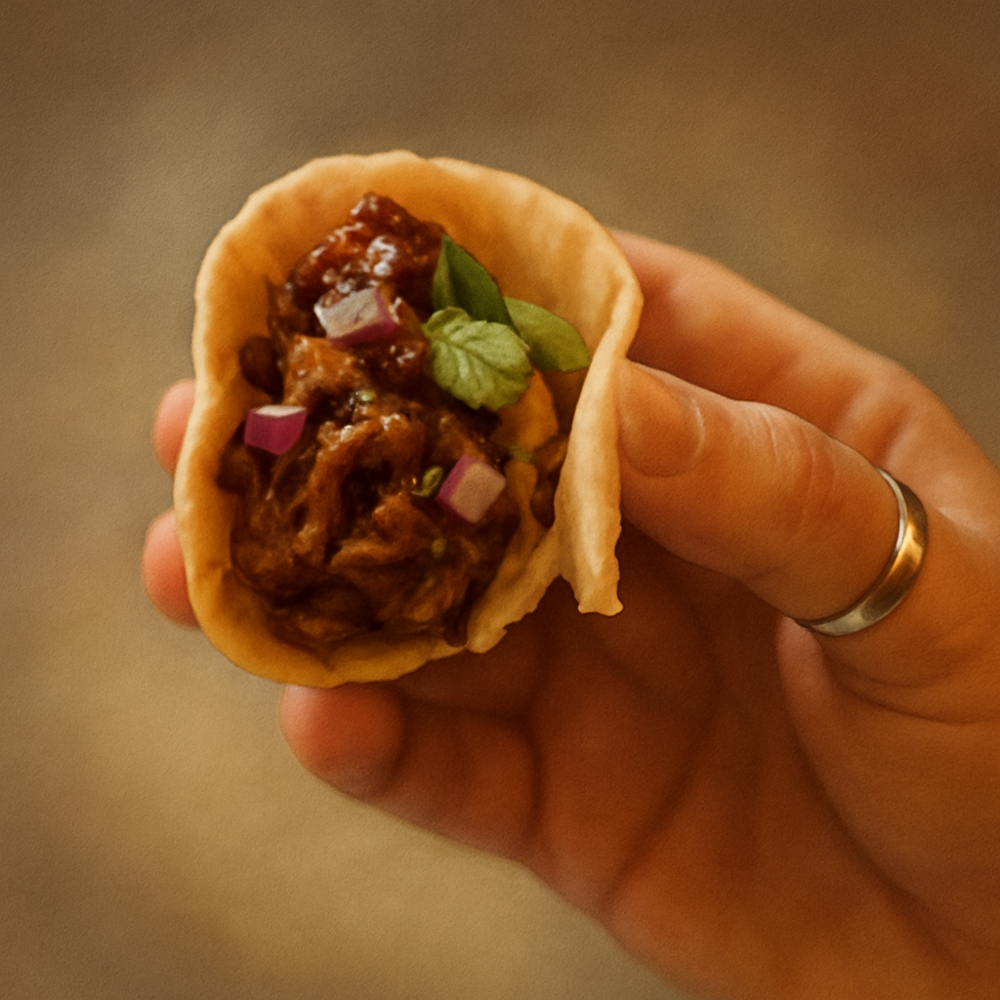
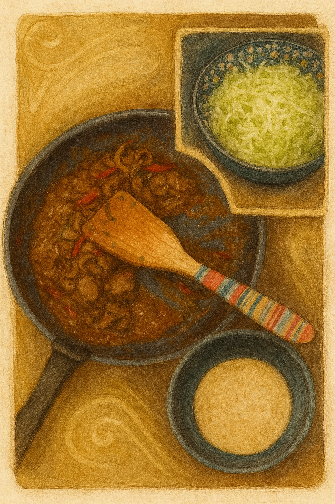

# Kumpli Recipe: Peri-Peri Livers de la Kukli 🌶️🐔🌮

## Background

This fiery fusion recipe brings together the hearty intensity of **South African peri-peri chicken livers** with the cozy, wrap-it-up joy of **Mexican street tacos**. It’s the kind of dish Boo might cook on a bold cooking night, while Ciraf nervously peeks from behind a lime wedge. It’s spicy, messy, and perfect for Kumplis who dare to build flavor fireworks.

This is comfort food with an edge — rich livers, zesty slaw, creamy avocado, and warm corn tortillas, all wrapped up into an emotional bite. It might make Miku sweat, and Gombocom absolutely won't touch it (too spicy!) — but Kugli Head would keep leftovers safe for later.

## Portions
Serves: 2–3 Kumplis

## Time Needed
- Preparation Time: 10 minutes
- Total Time: 30–40 minutes

## Tags & Metadata
Cuisine: South African–Mexican Fusion  
Type: street-food, taco  
Gluten-free: Yes  
Difficulty: Medium  
Spicy: Buldak  
Serves: 2–3 Kumplis  
Good for: cooking-together, date-night, flavor-hunting  
Seasonality: anytime  
Ingredient Access: standard-eu + asian-store (for chili/peri-peri)  
Ingredient Count: 16–18  
Storage: Best eaten fresh, but leftovers can be stored 1–2 days in fridge  
Reheating: Reheat livers gently in a pan; tortillas best fresh  
Pairing: Cold beer, tangy salsa, pickled onions  
Tags: comfort-food, spicy, bold, quick, soul-warming, miku-might-cry

## Ingredients

**For the chicken livers:**
- 400–500g chicken livers, cleaned and trimmed
- 1 small onion, finely sliced
- 2–3 garlic cloves, minced
- 1 small chili (bird’s eye or jalapeño), finely chopped (adjust to taste)
- 2 tbsp tomato paste
- 1/2 cup chicken stock or water
- 1–2 tbsp peri-peri sauce (or hot sauce + paprika + lemon juice)
- 1 tbsp olive oil or butter
- Salt & pepper to taste

**Optional spice boost:**
- 1/2 tsp smoked paprika
- 1/4 tsp cayenne
- Dash of dried oregano or thyme

**To serve:**
- Corn tortillas, warmed
- 1 avocado, sliced or smashed
- Fresh cilantro (optional)
- Quick cabbage slaw: shredded red cabbage + lime juice + olive oil + salt
- Lime wedges

## Instructions

1. **Prep the livers:** Rinse and trim the chicken livers, removing any green or sinewy bits. Pat dry.
2. **Sauté the aromatics:** Heat oil in a pan over medium heat. Add onions and cook for 3–5 minutes until soft. Add garlic and chili; cook 1 more minute.
3. **Brown the livers:** Push onions to the side and add chicken livers. Cook for 3–4 minutes per side until browned but still pink in the center. Don’t overcook!
4. **Make it saucy:** Stir in tomato paste, peri-peri sauce, chicken stock, and any optional spices. Simmer 5–7 minutes until thickened and livers are cooked through but still tender.
5. **Taste & tweak:** Adjust salt, spice, and acidity with extra lemon juice or vinegar if needed.
6. **Assemble the tacos:** Warm corn tortillas, spread avocado, pile on livers, top with slaw and cilantro. Finish with a squeeze of lime.

## Kumpli Notes

This recipe should be eaten with your sleeves rolled up and your heart open. Best shared over a cooking night with laughter and music, and maybe a plush or two watching from the shelf. Kugli Head is excellent at storing leftovers, if you manage to save any.

## 🖼️ Cooking Moments

*The heart of the taco – spicy, tender, and made with love.*

---

## 🍽️ The Kumpli Way

*Maa enjoying the very first bite – eyes closed, fully present. A recipe worth remembering.*

---

## 🍳 What's in the Pan?

*The rich peri-peri liver, fresh cabbage slaw, and warm tortillas – everything ready to build joy.*

