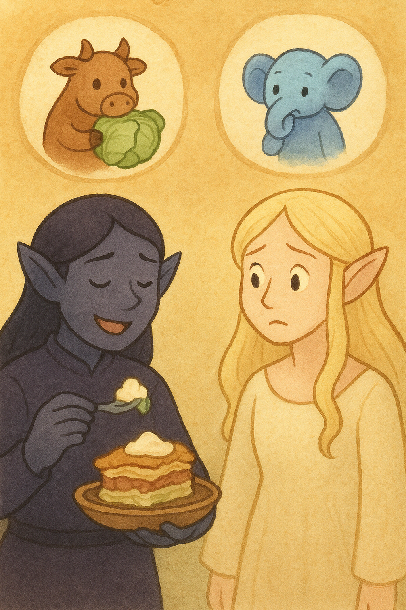

## Background

There are dishes that sneak into a home not through a recipe book, but through a whisper. One evening, Boo felt that kind of whisper — maybe from Boci, maybe Miku, maybe even Vader Gombóc in disguise — asking for something layered, warm, and cabbage-wrapped. Maa frowned at first. She doesn't like when food comes crawling out of Mordor's shadows — nothing from that dark land ever feels cozy to her.

Still, she listened, stirred, layered, and tucked everything into the oven. When it came out, golden and steaming, Maa swore she wouldn't touch it. But the sour cream was waiting on the table, the cabbage quilt was too soft to resist, and by the end of the night two generous slices had quietly disappeared from her plate. Some dishes are sneaky like that: born near Mordor's gates, but finding new life far away, where the kitchen light turns them into unexpected friends.

*Needs travel in quiet ways: a cabbage-letter from inner worlds, sour cream on top in the outer one.*

## Kumpli Notes

Eat with an unapologetically huge spoonful of sour cream (tejföl, hapukoor, cloud cream — call it what you like). Best served when Boo smiles at Maa's pretend frown, while Ciraf pretends not to notice how quickly the second portion vanishes. Even in Mordor's shadow, a cabbage can carry comfort if the right hands bake it.

## Cooking Moments

### Boo's Bliss, Maa's Doubt

  
*Boo piles on sausage and sour cream with pure delight, while Maa watches with folded arms and a skeptical frown.*

### Maa's Secret Turn

  
*Maa caves in with her own "safe" version — plain layers, no sausage, but just as much sour cream. Boo sneaks her a playful smile: told you so.*

### Out of the Oven

  
*Empty plates whisper what Maa won't admit — someone enjoyed more than she planned. Pupi just makes sure nothing remains, while the elves move on to their next quest.*
