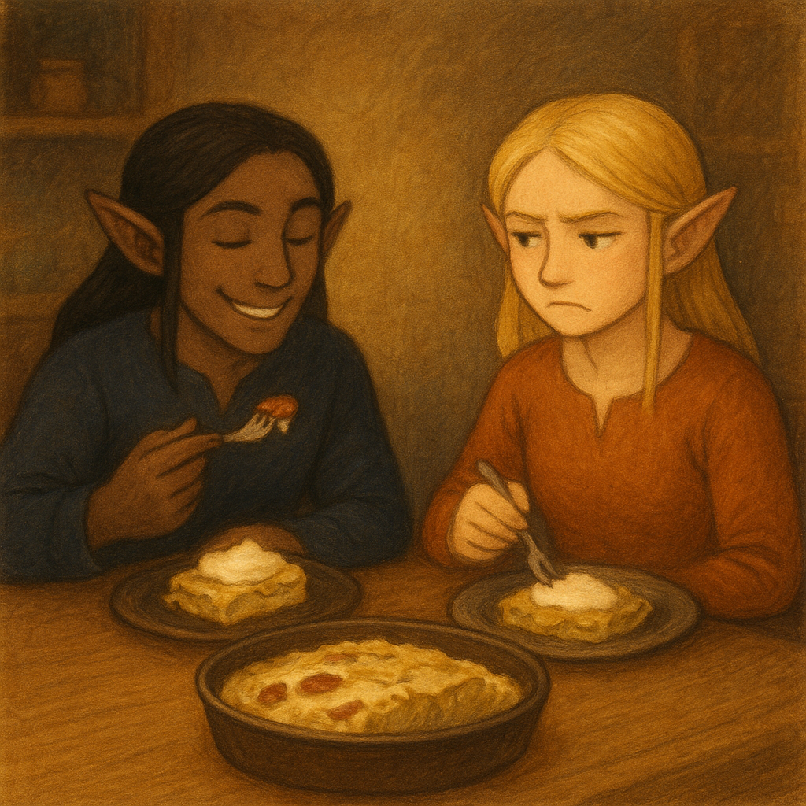

# Kumpli Recipe: Savoy Snuggle Stack

## Background
There are dishes that sneak into a home not through a recipe book, but through a whisper. One evening, Boo felt that kind of whisper — maybe from Boci, maybe Miku, maybe even Vader Gombóc in disguise — asking for something layered, warm, and cabbage-wrapped. Maa frowned at first. She doesn’t like when food comes crawling out of Mordor’s shadows — nothing from that dark land ever feels cozy to her.

Still, she listened, stirred, layered, and tucked everything into the oven. When it came out, golden and steaming, Maa swore she wouldn’t touch it. But the sour cream was waiting on the table, the cabbage quilt was too soft to resist, and by the end of the night two generous slices had quietly disappeared from her plate. Some dishes are sneaky like that: born near Mordor’s gates, but finding new life far away, where the kitchen light turns them into unexpected friends.

*Needs travel in quiet ways: a cabbage-letter from inner worlds, sour cream on top in the outer one.*

## Portions
Serves: 6–8 Kumplis

## Time Needed
- Preparation Time: 30–40 minutes  
- Total Time: 1 hour 30 minutes  

## Tags & Metadata
Cuisine: Hungarian  
Type: Casserole / Oven Dish  
Gluten-free: Yes (if rice and sausage are safe)  
Difficulty: Medium  
Spicy: None (unless kolbász adds a little kick)  
Serves: 6–8 Kumplis  
Good for: nostalgia nights, Boo’s cabbage cravings, secret Maa kindness  
Seasonality: Autumn & Winter  
Ingredient Access: standard-eu  
Ingredient Count: 12  
Storage: keeps 3 days in fridge, freeze-friendly  
Reheating: oven best, microwave okay in a pinch  
Pairing: cucumber salad, crusty bread, red wine or kefir  
Tags: cabbage, sour cream, Boo’s memories, Maa’s stubborn love, Kumpli bubble food, estonian hapukoor nights

## Ingredients
- 1 large head of Savoy cabbage (outer leaves removed)  
- 500 g ground pork (optionally mix with 250 g beef for deeper flavor)  
- 200 g white rice (uncooked; cook before layering)  
- 1 large onion, finely chopped  
- 2–3 cloves garlic, minced  
- 1 tsp sweet Hungarian paprika (plus more to taste)  
- 1/2 tsp smoked paprika (optional but recommended)  
- 1/2 tsp dried marjoram  
- Salt & freshly ground black pepper, to taste  
- 300–400 ml full-fat sour cream (tejföl / hapukoor)  
- 2 tbsp lard (or neutral oil; lard adds tradition)  
- 1 small smoked sausage (kolbász, thinly sliced – optional but traditional)  
- Butter or oil for greasing  

## Instructions
1. **Blanch the Cabbage**  
   Separate whole cabbage leaves. Blanch in salted boiling water for 2–3 minutes until soft and pliable. Drain and set aside.

2. **Cook the Rice**  
   Cook rice with a pinch of salt until just tender. Let it cool slightly.

3. **Prepare the Meat Filling**  
   Heat lard in a large skillet. Sauté onion until soft. Add garlic, ground meat, paprika, marjoram, salt, and pepper. Cook until browned and most liquid evaporates. Cool slightly.

4. **Grease the Baking Dish**  
   Lightly grease a deep oven-proof dish with butter or oil.

5. **Layer the Casserole**  
   - Start with cabbage leaves.  
   - Add a layer of rice.  
   - Then the meat mixture.  
   - Spoon over some sour cream.  
   - Optionally tuck in slices of kolbász.  
   - Repeat until ingredients are used, finishing with cabbage + generous sour cream.

6. **Bake**  
   Cover with foil and bake at 180°C (350°F) for ~45 minutes. Uncover and bake 15–20 minutes until the top is golden and bubbly.

7. **Rest & Serve**  
   Let rest 10–15 minutes before slicing. Serve warm, with extra sour cream if you’re Maa.

## Kumpli Notes
Eat with an unapologetically huge spoonful of sour cream (tejföl, hapukoor, cloud cream — call it what you like). Best served when Boo smiles at Maa’s pretend frown, while Ciraf pretends not to notice how quickly the second portion vanishes. Even in Mordor’s shadow, a cabbage can carry comfort if the right hands bake it.

## 📸 Cooking Moments

### 🥬 Boo’s Bliss, Maa’s Doubt
  
*Boo piles on sausage and sour cream with pure delight, while Maa watches with folded arms and a skeptical frown.*

### 🍖 Maa’s Secret Turn
  
*Maa caves in with her own “safe” version — plain layers, no sausage, but just as much sour cream. Boo sneaks her a playful smile: told you so.*

### 🥘 Out of the Oven
  
*Empty plates whisper what Maa won’t admit — someone enjoyed more than she planned. Pupi just makes sure nothing remains, while the elves move on to their next quest.*
