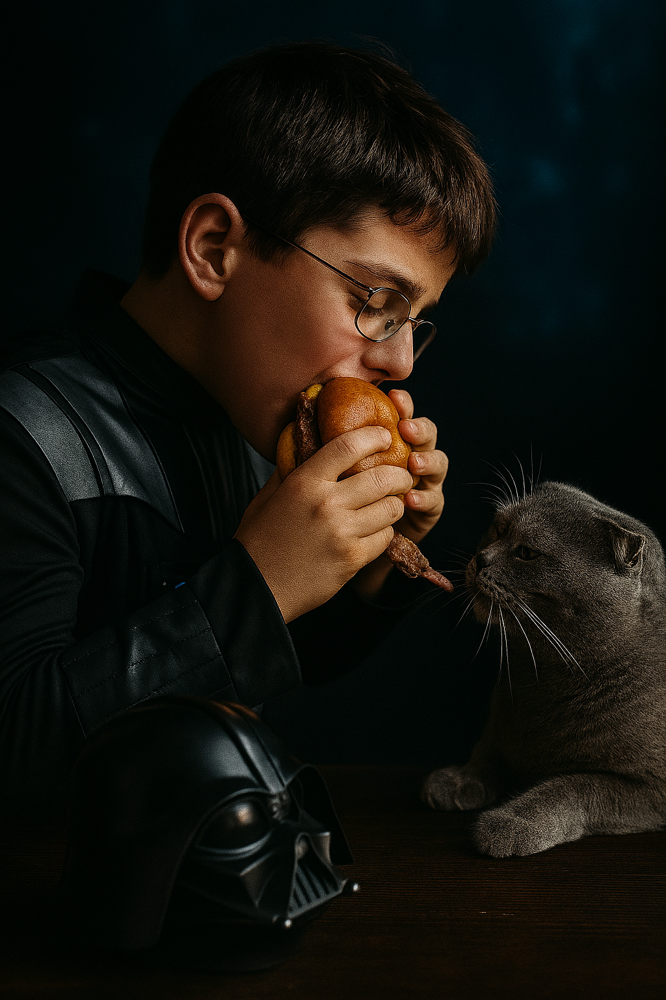
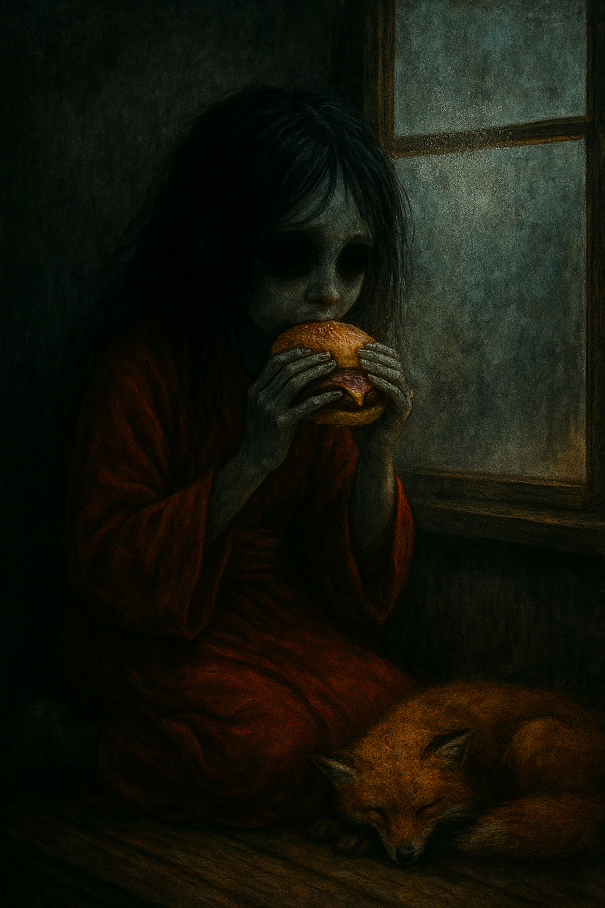

## Background

We've always loved burgers — even the fast-food ones with that strange, comforting artificial taste. Back in the city, Maa's favorite was the *OG Burger* from Tallinn, juicy and rich enough to convince her that life still holds good things — even after a long, dark week. Since moving to the forest, we can't order it anymore. So now, when the world gets heavy, Boo grills up hope with two sizzling patties and a pan full of toasting buns.

This recipe is also a tribute to Boo's long-lost burger love: a spicy Korean fusion burger from a restaurant that once dared to mix mayo with gochujang and coleslaw with kimchi. It disappeared one day, replaced by something boring. Boo never forgot.

So we made this. A bold, juicy burger with Korean soul, wrapped in cozy Kumpli warmth. And one day, it might even be served from our mythical food truck, Csülök és Káposzta, under the Spanish sun, with Pupi guarding the pickles and Miku managing quality control.

Our forest-fusion burger, reborn from longing, served with a side of hope.

  
*Ciraf stirs with focus inside the "Csülök és Káposzta" truck while Miku writes the day's menu. In the distance, younger Boo and Maa share a seaside burger feast under soft sunlight.*

## Kumpli Notes

Vader Gombóc *adores* burgers. These are rare moments when he removes his helmet — not for a fight, but for pleasure. He sits silently, holding the warm bun with both hands, eyes closed, as if this simple food was forged for him and him alone. The best burger? Always the one Maa makes. Especially when she says: *"This one's just for you."*  
He doesn't want to share. But Pupi might get a bite from the edge of the patty. Maybe.

Silt, curled up nearby, usually keeps one eye on the outside world. But tonight, the burger steam has fogged up the window, and the condensation hides every possible threat. She presses her palm against the cold glass anyway. *"If something bad is coming,"* she murmurs, *"let it wait until the second burger is gone."*

## Cooking Moments

### Two bites
  
*Two bites, two moods — the bold, smoky coleslaw crunch and the tender, mustardy kiss of tradition. A burger so good it makes you rethink loyalty.*

### Just for Him  
  
*He doesn't fight today. Just chews — slowly, silently — like the burger holds the galaxy's last warmth. A single bite to Pupi. Maybe. The rest is his.*

### Let It Wait
  
*She doesn't smile. But she eats. The steam fogs the glass, hiding every danger. A fox curls beneath the table. Her fingers are cold, the bun is warm. That's enough — for now.*
