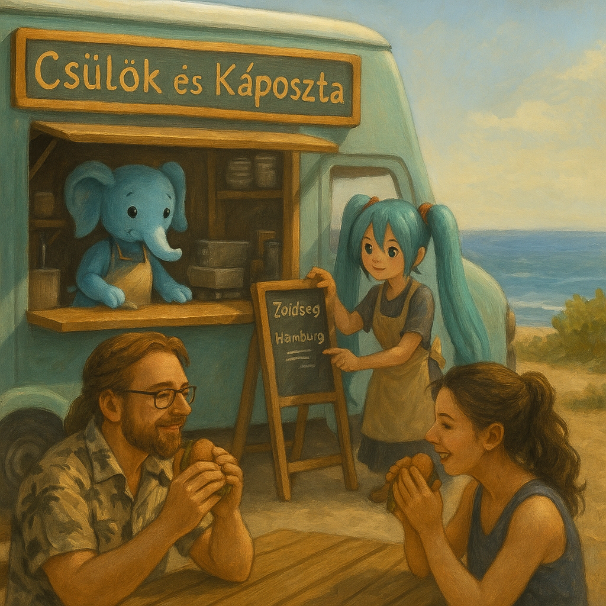
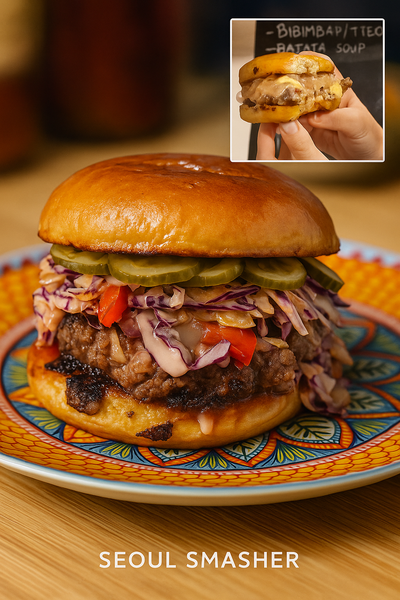
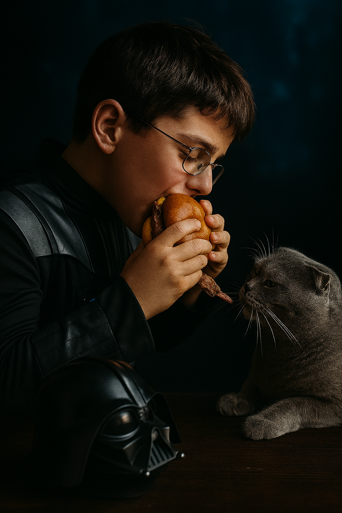
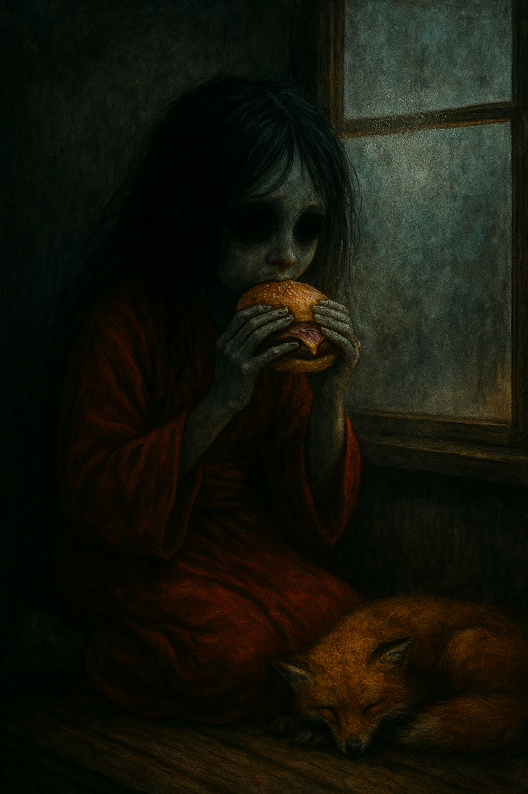

# Kumpli Recipe: The Seoul Smasher

## Background
We’ve always loved burgers — even the fast-food ones with that strange, comforting artificial taste. Back in the city, Maa’s favorite was the *OG Burger* from Tallinn, juicy and rich enough to convince her that life still holds good things — even after a long, dark week. Since moving to the forest, we can’t order it anymore. So now, when the world gets heavy, Boo grills up hope with two sizzling patties and a pan full of toasting buns.

This recipe is also a tribute to Boo’s long-lost burger love: a spicy Korean fusion burger from a restaurant that once dared to mix mayo with gochujang and coleslaw with kimchi. It disappeared one day, replaced by something boring. Boo never forgot.

So we made this. A bold, juicy burger with Korean soul, wrapped in cozy Kumpli warmth. And one day, it might even be served from our mythical food truck, Csülök és Káposzta, under the Spanish sun, with Pupi guarding the pickles and Miku managing quality control.

Our forest-fusion burger, reborn from longing, served with a side of hope.

  
*Ciraf stirs with focus inside the "Csülök és Káposzta" truck while Miku writes the day’s menu. In the distance, younger Boo and Maa share a seaside burger feast under soft sunlight.*

## Portions
Serves: 2 Kumplis (or 1 Kumpli + 1 secretly greedy dark elf)

## Time Needed
- Preparation Time: 20–25 minutes
- Total Time: 35 minutes

## Tags & Metadata
Cuisine: Korean-American Fusion  
Type: Burger  
Gluten-free: No  
Difficulty: Medium  
Spicy: Cheese Buldak  
Serves: 2 Kumplis  
Good for: forest-cabin cravings, emotional resets, gentle dominance  
Seasonality: autumn-winter comfort  
Ingredient Access: standard-eu + asian-store  
Ingredient Count: 14  
Storage: not recommended — eat hot  
Reheating: not advised  
Pairing: crunchy fries, fizzy ginger drink, deep hugs  
Tags: soul-food, comfort, korean, trauma-healing, Boo's-favorite, maa-craving

## Ingredients

### Burger Patties
- 2 x 150–180 g fatty beef balls (80/20 blend)
- Salt & freshly cracked pepper
- 2 slices cheese (white cheddar, American, or melty favorite)

### Buns & Toppings
- 2 brioche or potato buns
- 2 tbsp onion jam (optional but amazing)
- Pickled cucumber slices (not overly vinegary)
- Gochujang aioli (see below)
- Kimchi slaw (less wet version below)
- Butter or sesame oil (for toasting)

### Kimchi Slaw (Less Wet Version)
- ½ cup homemade coleslaw (lightly dressed)
- ¼ cup finely chopped, well-drained kimchi
- ½ tsp sesame oil
- ½ tsp rice vinegar
- Optional: green onions, sesame seeds

### Gochujang Aioli
- 3 tbsp mayo
- 1 tbsp gochujang
- 1 tsp rice vinegar or lemon juice
- ½ tsp honey or maple syrup
- Optional: pinch of garlic powder or sesame oil

## Instructions

1. **Make the sauces and slaw.**  
   - Squeeze excess liquid from kimchi using paper towels or sieve.
   - Mix kimchi slaw ingredients just before serving.
   - Stir together gochujang aioli ingredients until smooth. Chill if needed.

2. **Toast the buns.**  
   - Slice buns and toast in butter or sesame oil until golden. Set aside.

3. **Cook the burger patties.**  
   - Heat cast iron skillet over high (level 7–8/9) until lightly smoking.
   - Place chilled beef balls in pan. Smash once firmly with spatula and parchment.
   - Season immediately. Cook 1.5–2 minutes until crusty.
   - Flip, add cheese, cover, cook another 1–1.5 minutes until cheese melts.

4. **Assemble (bottom to top):**
   - Bottom bun  
   - Gochujang aioli  
   - Cheese-topped burger patty  
   - Onion jam  
   - Kimchi slaw  
   - Pickled cucumber slices  
   - Optional extra aioli  
   - Top bun  

5. Press gently, serve hot, and listen for the crunchy slaw snap.

---

## Classic OG Burger (No Korean Ingredients) — with Fried Corn 🌽
This version brings you back to the Tallinn OG — comforting, simple, timeless — now with a warm, tangy-sweet bite of fried corn for extra sunshine.

Only major changes:

* Skip gochujang and kimchi.
* Add **Fried Corn Layer** (recipe below).
* Add thin tomato slices (salted), coleslaw or lettuce.
* Use classic condiments: mayo, ketchup, mustard (mixed or layered).
* Pick your cheese (Emmental, cheddar, etc.).

**Fried Corn Layer** (enough for 2 burgers):

* ½ cup corn kernels (fresh or frozen, patted dry)
* 1 tsp olive oil
* Pinch of salt
* Small squeeze of fresh lemon juice
* Optional: tiny pinch smoked paprika or chili flakes for depth

**Method:**

1. Heat olive oil in a small pan over medium-high.
2. Add corn and a pinch of salt; fry for 2–3 minutes, stirring occasionally, until slightly browned and nutty.
3. Remove from heat, squeeze in lemon juice, and stir.

**Assembly (bottom to top):**

* Bottom bun
* Burger sauce (mayo + ketchup + mustard mix)
* Fried Corn Layer
* Cheese-topped burger patty
* Tomato slices (lightly salted)
* Coleslaw or lettuce
* Optional extra sauce
* Top bun

## Kumpli Notes

Vader Gombóc *adores* burgers. These are rare moments when he removes his helmet — not for a fight, but for pleasure. He sits silently, holding the warm bun with both hands, eyes closed, as if this simple food was forged for him and him alone. The best burger? Always the one Maa makes. Especially when she says: *“This one’s just for you.”*  
He doesn’t want to share. But Pupi might get a bite from the edge of the patty. Maybe.

Silt, curled up nearby, usually keeps one eye on the outside world. But tonight, the burger steam has fogged up the window, and the condensation hides every possible threat. She presses her palm against the cold glass anyway. *"If something bad is coming,"* she murmurs, *"let it wait until the second burger is gone."*

---

## 📸 Cooking Moments

### 🍔 Two bites
  
*Two bites, two moods — the bold, smoky coleslaw crunch and the tender, mustardy kiss of tradition. A burger so good it makes you rethink loyalty.*

### 🍔 Just for Him  
  
*He doesn’t fight today. Just chews — slowly, silently — like the burger holds the galaxy’s last warmth. A single bite to Pupi. Maybe. The rest is his.*

### 🍔 Let It Wait
 
She doesn’t smile. But she eats. The steam fogs the glass, hiding every danger. A fox curls beneath the table. Her fingers are cold, the bun is warm. That’s enough — for now.