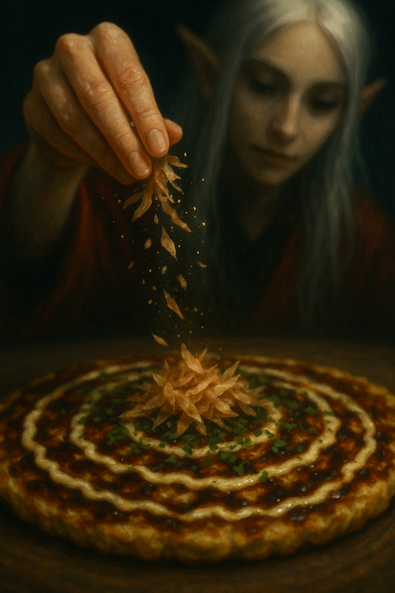

## Background

A cheerful Japanese chef once rolled in with his street stall, not far from where Maa and Boo lived many years ago, testing how locals would welcome this savory pancake from his homeland. We were curious — and one bite later… hooked. It was smoky, saucy, and full of cabbage magic. But the real spark came from the combination of silky Japanese mayo and rich okonomiyaki sauce, a pairing that turned the humble pancake into something unforgettable. Since then, we've been on a quiet quest to recreate that perfect balance in our own kitchen.

Fast forward to our forest kitchen in Estonia. We'd tasted okonomiyaki across Europe, but few lived up to that first spark. One winter evening, as snow fell outside and the cats snored under the table, we made a batch that was… different. Better. The cabbage was sweeter, the batter lighter, the toppings just right. We looked at each other and laughed:  
*"If we sold this, it would be the best okonomiyaki around here."*

And so a new Kumpli dream was born: someday, under the warm Spanish sun, we'd open a little food truck called **Csülök és Káposzta**. We'd serve our perfect okonomiyaki to curious wanderers — perhaps a little raven feather tucked near the sauce bottles — and watch as they took their first bite, just like we once did.

  
*Falling flakes or pixie dust? Only Maa knows — but the okonomiyaki listens.*

## Kumpli Notes

Best made when the kitchen windows are fogged up and you don't mind smelling like joy for hours. Maa likes hers pure and balanced — just batter, cabbage, pork, and maybe an egg crown. Boo can't resist sneaking in new ingredients, testing topping combinations, or layering extra flavors "just to see what happens."

## Cooking Moments

### 🌿 The Green Crown

  
*Golden, crisp, and striped with love — finished with a crown of fresh green onions fit for a Kumpli feast.*

### 🍄 Forest Cottage Bite

  
*Elf Maa leans over her plate, a shy streak of sauce on her lips — as if the forest itself dared her to taste its magic.*
