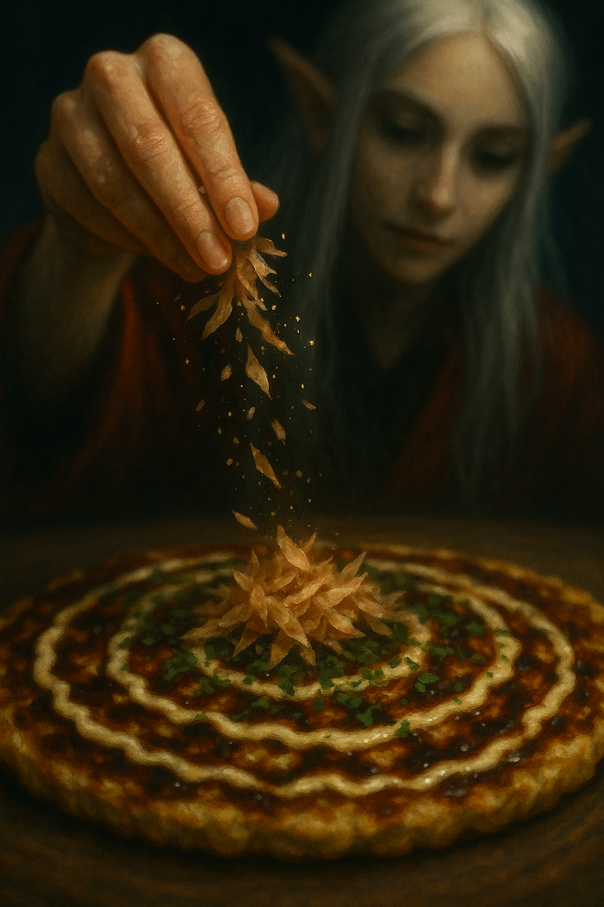
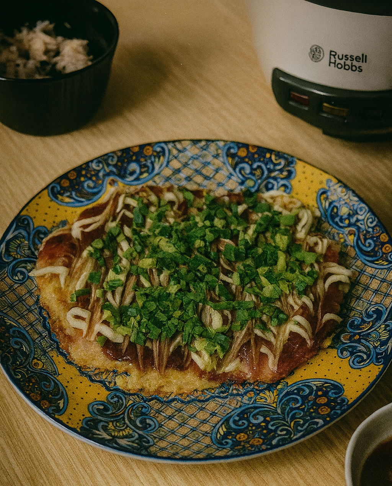

# Kumpli Recipe: The Ultimate Okonomiyaki

## Background
A cheerful Japanese chef once rolled in with his street stall, not far from where Maa and Boo lived many years ago, testing how locals would welcome this savory pancake from his homeland. We were curious — and one bite later… hooked. It was smoky, saucy, and full of cabbage magic. But the real spark came from the combination of silky Japanese mayo and rich okonomiyaki sauce, a pairing that turned the humble pancake into something unforgettable. Since then, we’ve been on a quiet quest to recreate that perfect balance in our own kitchen.

Fast forward to our forest kitchen in Estonia. We’d tasted okonomiyaki across Europe, but few lived up to that first spark. One winter evening, as snow fell outside and the cats snored under the table, we made a batch that was… different. Better. The cabbage was sweeter, the batter lighter, the toppings just right. We looked at each other and laughed:  
*"If we sold this, it would be the best okonomiyaki around here."*

And so a new Kumpli dream was born: someday, under the warm Spanish sun, we’d open a little food truck called **Csülök és Káposzta**. We’d serve our perfect okonomiyaki to curious wanderers — perhaps a little raven feather tucked near the sauce bottles — and watch as they took their first bite, just like we once did.

  
*Falling flakes or pixie dust? Only Maa knows — but the okonomiyaki listens.*

## Portions
Serves: 4 Kumplis (or 2 Kumplis with heroic appetites)

## Time Needed
- Preparation Time: 20 minutes
- Total Time: 35–40 minutes

## Tags & Metadata
Cuisine: Japanese  
Type: Savory pancake  
Gluten-free: No (unless flour is swapped)  
Difficulty: Medium  
Spicy: None (unless you add chili oil)  
Serves: 4 Kumplis  
Good for: cooking-together, rainy-day ritual, playful experiments  
Seasonality: anytime  
Ingredient Access: standard-eu + asian-store  
Ingredient Count: 15–18 (depending on extras)  
Storage: best fresh, can refrigerate up to 1 day  
Reheating: pan preferred, low-medium heat  
Pairing: miso soup, green tea, pickled vegetables  
Tags: soul-food, food-truck-dream, Boo-experiments, Maa-classic, okonomiyaki-love

## Ingredients

### Batter
- 190 g all-purpose flour (about 1 ½ cups)
- 180 ml dashi (or water + ½ tsp dashi powder) (~¾ cup)
- 60 ml mirin (~¼ cup)
- 1 tsp baking powder
- 1 tsp salt
- 8 g sugar (~2 tsp)
- 4 large eggs

### Veggies & Protein
- 450 g cabbage, coarsely chopped (about 10 cups loosely packed)
- 115 g mung bean sprouts (about 2 cups)
- 25 g chopped scallions (about ¼ cup)
- 225 g fresh pork belly, thinly sliced (**or** use bacon for convenience)
- Optional: 115 g shrimp or squid

### Optional Hiroshima-style Layer
- 280 g yakisoba noodles or fresh ramen  
  *(cooked & lightly seasoned with 1 tbsp / ~15 ml Worcestershire sauce)*

### Toppings
- 60 ml okonomiyaki sauce (~¼ cup)
- 60 ml Kewpie mayo (~¼ cup)
- 4 g aonori (about ¼ cup loosely packed powdered nori)
- Bonito flakes (katsuobushi), small handful (~5 g)
- Extra chopped scallions for garnish

### For Cooking
- 60 ml toasted sesame oil (~¼ cup)

## Instructions
1. **Make the batter first.**  
   In a large bowl, whisk together flour, dashi, mirin, baking powder, salt, and sugar. Beat in eggs until smooth.

2. **Rest the batter.**  
   Let it sit for 15 minutes so the flour hydrates and the flavor develops.

3. **Add veggies just before cooking.**  
   Fold in cabbage, bean sprouts, and scallions so they stay crisp and don’t release too much liquid.

4. **Heat the pan.**  
   Place a large cast-iron skillet or nonstick pan over medium heat. Add 1 tbsp (15 ml) sesame oil and spread evenly.

5. **Cook the meat side first.**  
   Lay a few slices of pork belly or bacon in the skillet. Once they start to turn opaque, spoon some batter over them to form a pancake ~15 cm across.

6. **Optional noodle layer.**  
   If using noodles, spread about 70 g cooked noodles over the pancake before flipping.

7. **Flip & cook the second side.**  
   Cook for about 4–5 minutes on the first side, then flip carefully.

8. **Optional egg-on-top method.**  
   After flipping, crack a raw egg onto the center of the pancake. Cover with a lid and cook until the white is set but the yolk is still slightly runny (about 2–3 minutes).

9. **Finish & serve.**  
   Drizzle generously with okonomiyaki sauce and Kewpie mayo in a crisscross pattern. Sprinkle with aonori, bonito flakes, and scallions.

10. **Eat immediately.**  
    Cut into quarters and serve hot.

## Kumpli Notes
Best made when the kitchen windows are fogged up and you don’t mind smelling like joy for hours. Maa likes hers pure and balanced — just batter, cabbage, pork, and maybe an egg crown. Boo can’t resist sneaking in new ingredients, testing topping combinations, or layering extra flavors “just to see what happens.”

## 📸 Cooking Moments

### 🌿 The Green Crown
  
*Golden, crisp, and striped with love — finished with a crown of fresh green onions fit for a Kumpli feast.*

### 🍄 Forest Cottage Bite
  
*Elf Maa leans over her plate, a shy streak of sauce on her lips — as if the forest itself dared her to taste its magic.*
