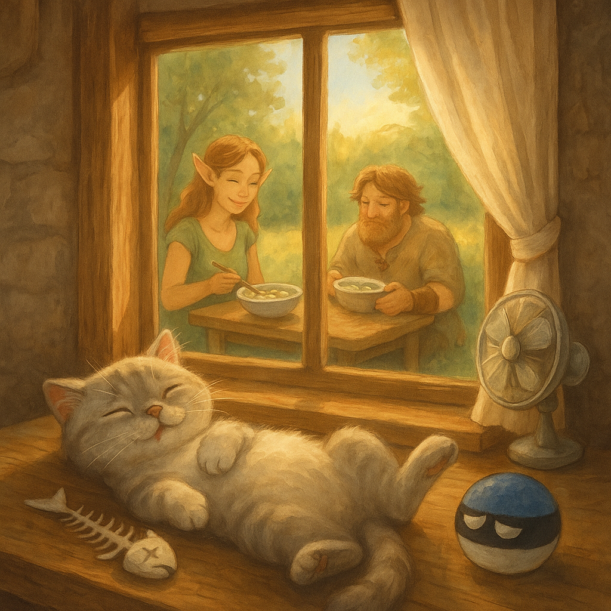

## Background
In Estonia, summer "heat" is a mythical creature — it appears once a year, flaps its wings for a few hours, and disappears again into the Baltic mist. On that rare day when the sun dares to push the temperature up to a sweltering **25°C**, the locals fan themselves dramatically and declare it *"almost tropical."*  
That's when you know it's külmsupp season.

One such legendary afternoon, Tor-Boo — our almost-viking Boo — set out to fish for the freshest catch. Naturally, he brought Pupi along, sneaking her into the boat with promises of teaching her "the noble fisherman's ways." Pupi, ever the opportunist, quickly discovered that "fishing" really meant eating half the bait and a good share of the actual fish before they even made it into the bucket.

By the time they returned to our forest cottage, the basket was… *lighter* than expected, but still brimming with enough marinated herring for a feast. Maa rolled up her sleeves and made a cooling, creamy, herby külmsupp — the kind that makes you forget the sun is even shining. Everyone dug in greedily, except Pupi, who politely declined: she was already quite full from her "fishing lessons."

  
*Maa ladles the first bowls of creamy külmsupp under the rare Estonian "heatwave" sun, while Tor-Boo arrives with just enough fish for a proper Kumpli feast.*

## Kumpli Notes
The külmsupp was devoured in blissful silence — except for Tor-Boo, who finally confessed over his second bowl:  
"I can catch them, but I can't… you know… *finish* them. Too slippery. Too disgusting for a mighty Tor."  
Pupi, curled up nearby, licked her whiskers. Mystery solved: she'd taken on the *other* part of the job. And that's why, on that warm summer day, Pupi was the only one in the house who skipped the soup — she was already full of "training fish."

## Cooking Moments

### 🥣 Hero of the Table
  
*Dill, egg, potato, herring — a northern summer in one bowl, best served with rye bread and the window open to the forest breeze.*

### 🐟 Viking, Biking, and Slightly Yiking

  
*ETor-Boo catches them, Pupi finishes them. Some fish live to swim another day — others meet the paw.*

### 💤 Fishbone Siesta
  
*Belly full, sun warm, fishbone clean. Through the window, the feast continues without her.*
