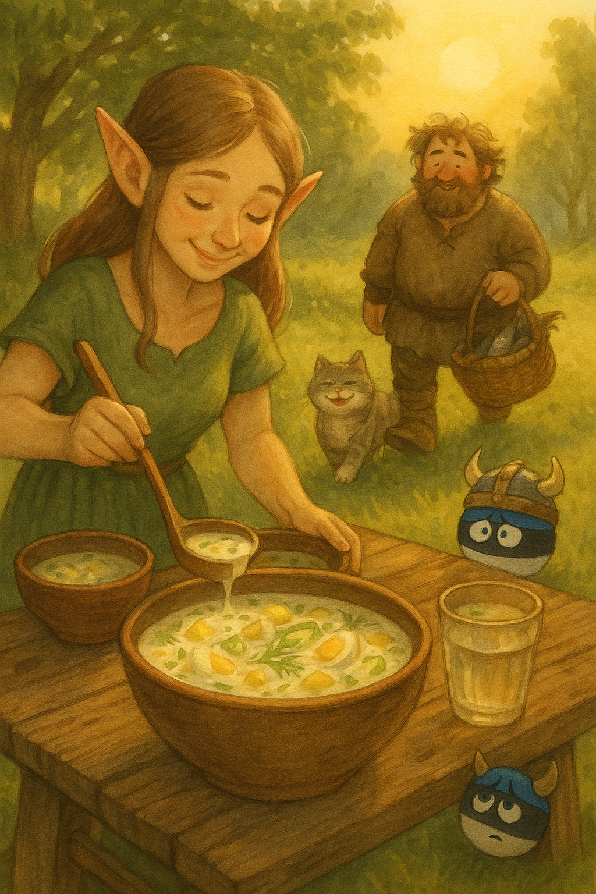
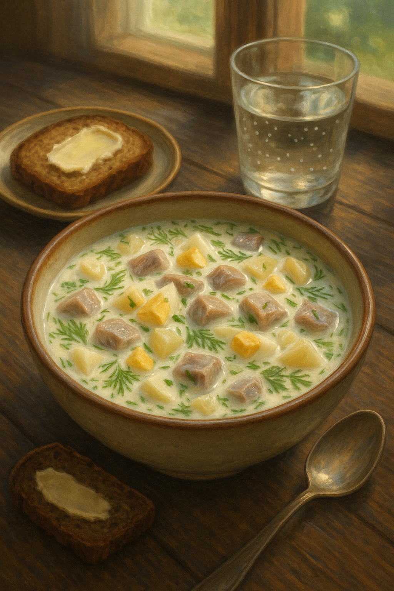
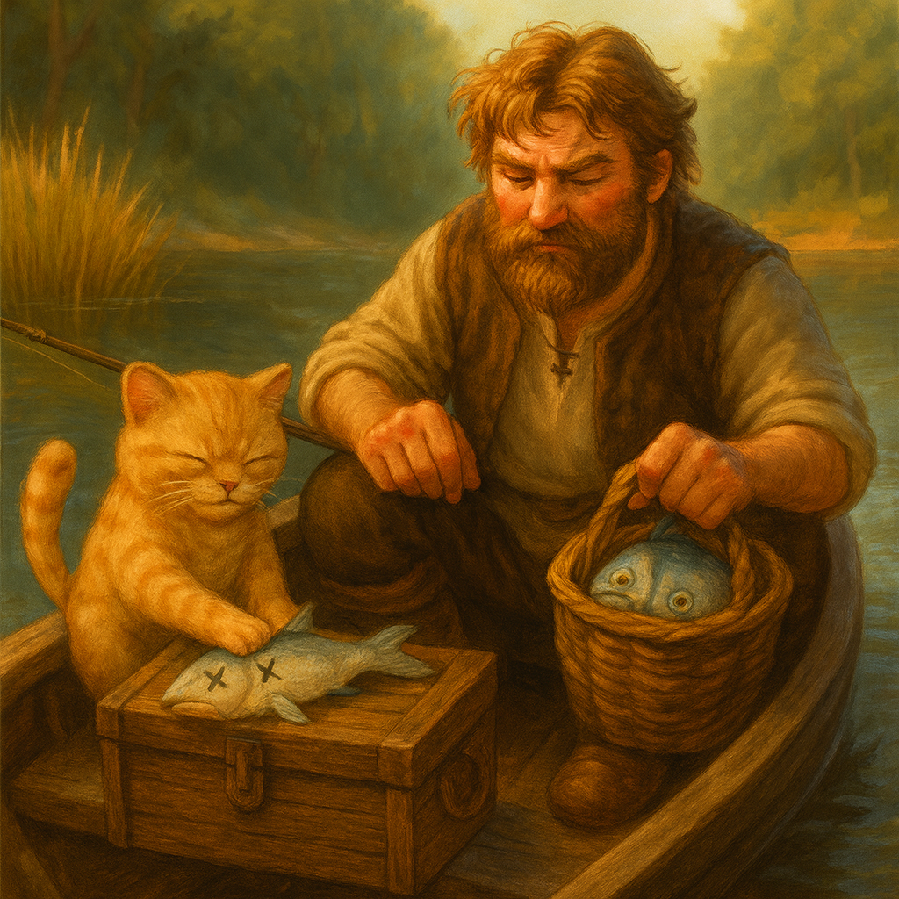
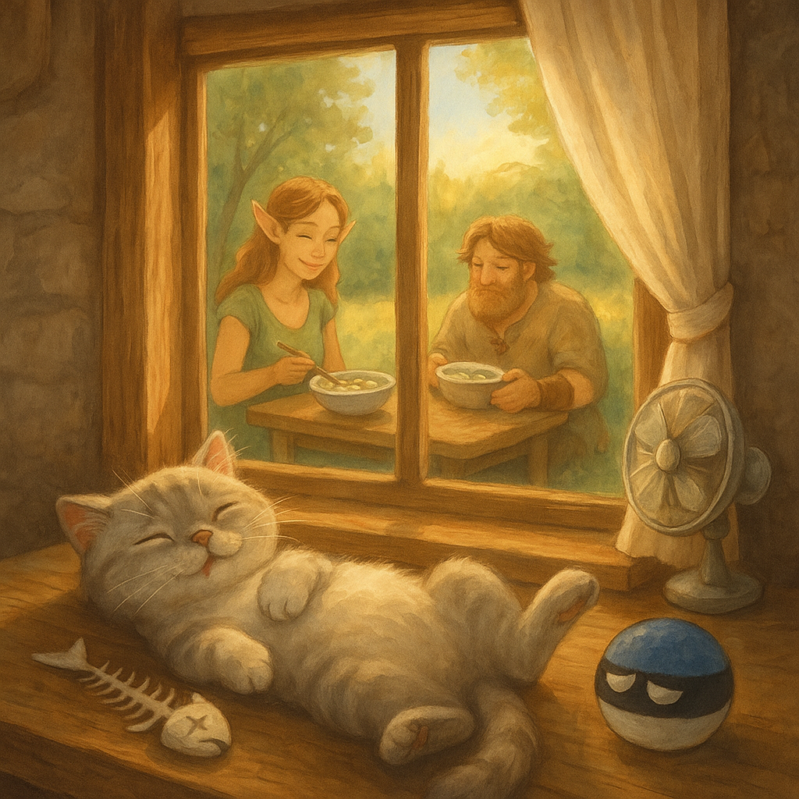

# Kumpli Recipe: ❄️🐟 Tor-Boo’s Külmsupp for Estonian “Heatwaves”

## Background
In Estonia, summer “heat” is a mythical creature — it appears once a year, flaps its wings for a few hours, and disappears again into the Baltic mist. On that rare day when the sun dares to push the temperature up to a sweltering **25°C**, the locals fan themselves dramatically and declare it *“almost tropical.”*  
That’s when you know it’s külmsupp season.

One such legendary afternoon, Tor-Boo — our almost-viking Boo — set out to fish for the freshest catch. Naturally, he brought Pupi along, sneaking her into the boat with promises of teaching her “the noble fisherman’s ways.” Pupi, ever the opportunist, quickly discovered that “fishing” really meant eating half the bait and a good share of the actual fish before they even made it into the bucket.

By the time they returned to our forest cottage, the basket was… *lighter* than expected, but still brimming with enough marinated herring for a feast. Maa rolled up her sleeves and made a cooling, creamy, herby külmsupp — the kind that makes you forget the sun is even shining. Everyone dug in greedily, except Pupi, who politely declined: she was already quite full from her “fishing lessons.”

  
*Maa ladles the first bowls of creamy külmsupp under the rare Estonian “heatwave” sun, while Tor-Boo arrives with just enough fish for a proper Kumpli feast.*

## Portions
Serves: 6 Kumplis (or 8 if serving with hearty rye bread)

## Time Needed
- Preparation Time: 35 minutes (plus chilling)
- Total Time: 4 hours (including chilling time)

## Tags & Metadata
Cuisine: Estonian  
Type: cold soup  
Gluten-free: Yes (if bread served is GF)  
Difficulty: Easy  
Spicy: None  
Serves: 6  
Good for: summer-lunch, Estonian-heatwave, fishing-day  
Seasonality: summer  
Ingredient Access: standard-eu  
Ingredient Count: 14 ingredients  
Storage: keeps 2–3 days in fridge  
Reheating: don’t — it’s best cold  
Pairing: black rye bread, buttered karask  
Tags: refreshing, creamy, dill, fishing-story, pupi-approved

## Ingredients

### 🐟 Fish & Protein
- 300 g marinated herring fillet (light oil or mild brine)
- 5 large eggs, hard-boiled and chopped

### 🥔 Vegetables
- 5 medium waxy potatoes (boiled in skins, peeled, diced)
- 1 large cucumber (or 2 small), finely diced
- 1 bunch spring onions (or 1 small red onion), finely chopped
- 15–20 g fresh dill, chopped

### 🥛 Creamy Liquid Base
- 600 ml kefir  
- 250 ml sour cream (hapukoor)  
- 250 ml cold sparkling mineral water  
- 1 tsp mild mustard (Dijon or Estonian style)  
- 1–2 tsp fresh lemon juice (or mild vinegar like white wine or apple cider)

### 🧂 Seasoning
- Salt & freshly cracked black pepper (start light — adjust after chilling)

## Instructions
1. **Boil & Prep Veggies:**  
   Boil the potatoes in salted water (skin-on) until tender. Cool, peel, and dice into bite-sized chunks. Hard-boil the eggs, peel, and chop.

2. **Dice the Rest:**  
   Dice cucumber, chop onions and dill. Cut herring into bite-sized cubes. If the marinade is too strong or vinegary, rinse lightly and pat dry.

3. **Mix the Base:**  
   In a large bowl, whisk kefir, sour cream, mineral water, mustard, and lemon juice until smooth. Taste and season lightly — remember, the herring brings saltiness.

4. **Assemble the Soup:**  
   Gently stir potatoes, eggs, cucumber, onion, dill, and herring into the base. Don’t overmix — a chunky, rustic look is part of the charm.

5. **Chill Thoroughly:**  
   Cover and refrigerate for at least 4 hours (overnight for peak flavor). This step is crucial — the flavors deepen and marry beautifully.

6. **Serve Cold:**  
   Ladle into bowls and garnish with extra dill or a boiled egg half. Serve with black rye bread or buttered karask.

## Kumpli Notes
The külmsupp was devoured in blissful silence — except for Tor-Boo, who finally confessed over his second bowl:  
“I can catch them, but I can’t… you know… *finish* them. Too slippery. Too disgusting for a mighty Tor.”  
Pupi, curled up nearby, licked her whiskers. Mystery solved: she’d taken on the *other* part of the job. And that’s why, on that warm summer day, Pupi was the only one in the house who skipped the soup — she was already full of “training fish.”

## 📸 Cooking Moments

### 🥣 Hero of the Table
  
*Dill, egg, potato, herring — a northern summer in one bowl, best served with rye bread and the window open to the forest breeze.*

### 🐟 Viking, Biking, and Slightly Yiking

  
*ETor-Boo catches them, Pupi finishes them. Some fish live to swim another day — others meet the paw.*

### 💤 Fishbone Siesta

*Belly full, sun warm, fishbone clean. Through the window, the feast continues without her.*