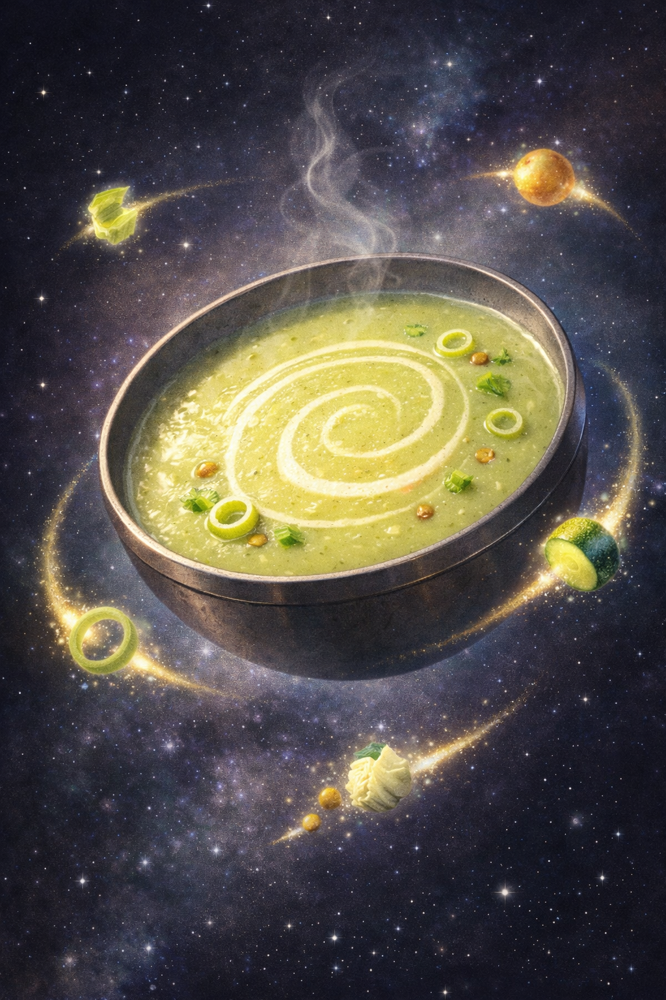

## Background

Alarms: stress-level high, gut-mood low. Maa, chief botanist of the Allagan pantry, initiates Operation Green Comet: leek thrusters, celery stabilizers, lentil core. The cauldron hums like a tiny warp drive—then the galley windows iris open to a quiet grove: moss-lit counters, a life-tree shadow on chrome. Maa taps the rim and murmurs an herb-charm; the steam curls into little green comets that drift like fireflies. Miku twirls a leek—half lightsaber, half wind-spell—and the ship seems to breathe with the forest. The tonic touches down in Boo’s bowl—silky, bright, merciful—engineered to soothe the tum and guided to earth by roots. Primary engines: leek + celery + lentil. Flavor satellites: cabbage, potato, zucchini, orbiting purely for pleasure. Not just soup; a soft reboot and a gentle grounding.

*planetary calm — operation green comet complete.*

## Kumpli Notes

Galley log, overheard as the tonic comes in for a gentle landing:

- Galley AI: "Primary engines online: leek, celery, lentil."
- Miku: "Warp-belly in three... two... spin!"
- Maa: "Roots steady, breath slow. Green Comet—hold to the heartwood."
- Boo: "Systems nominal. Request second landing."

## Cooking Moments

### Witch-systems synced; brew complete

*When Maa stirs, even the stars remember how to breathe.*

### Warp-spin logged: operation success

*Every world needs one who stirs joy into gravity — that’s Miku’s dance.*
